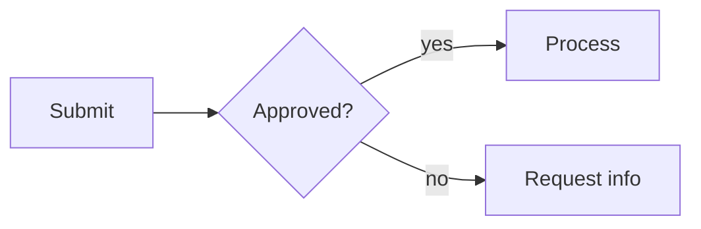
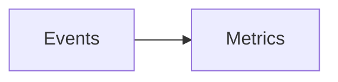

# md-doc handbook

One guide for people and agents: authoring documents, forms, templates and slide decks,
plus the complete configuration, theme and command references. Paste this **entire file**
into an agent with your draft; no separate authoring prompt is needed. For reading, use
the contents below to jump to the task you are working on.

## Using this handbook with a draft

Tell the agent the output you want, for example: “Convert the draft below into a PDF report
using this handbook.” Optionally provide the project folder, existing `_meta.yml` values,
merge-field schema, template names and asset paths. Without project context, use a standalone
Markdown file with `outputs: [pdf]` and `cover_page: false`; choose other formats when requested.

Use only the section relevant to the requested task. Workspace setup and theme maintenance
are separate tasks; do not run those procedures when the user only asks to author a draft.

When acting as the authoring agent:

- Return one complete `.md` file in a fenced Markdown block (use a longer outer fence when
  the document contains code fences), or save it when the user requests file edits.
- Preserve source facts, names, figures, dates, caveats and obligations. Improve structure
  without inventing content. Keep known values as text unless a reusable template is requested.
- Use only defined Jinja variables and confirmed includes/assets. New standalone variables
  must be defined in the document frontmatter. Ask for essential missing facts; omit unknown
  optional metadata rather than inserting unfinished placeholders.
- Use `[[fields]]` only for requested Word templates, and `?[...]` for requested forms.
  DOTX fields default to fillable Text Form Fields; classic mail merge requires
  `dotx_field_type: merge`. Do not automatically turn a letter into a blank template.
- Preserve supplied project branding and defaults. Ask a concise question only when a
  material ambiguity prevents a usable result; otherwise use the defaults above.
- For decks, condense slide text while retaining source detail and caveats in speaker notes.
  Do not invent metrics or quotes to fill a layout.
- If repository tools are available, inspect project instructions/config, lint and build the
  specific document, and report what was actually checked. Otherwise return the source without
  claiming build validation. Live company documents belong in `workspace/`, not `examples/`.

## Contents

- [Getting started](#getting-started)
- [Authoring documents](#authoring)
- [Markdown syntax](#markdown)
- [Forms](#forms)
- [Slides](#slides)
- [Themes](#themes)
- [Word and PDF](#word-and-pdf)
- [Configuration reference](#configuration)
- [Command reference](#commands)
- [Exporting](#exporting)
- [Extracting](#extracting)
- [Troubleshooting](#troubleshooting)
- [Python API](#python-api)
- [Set up a company workspace](#workspace-setup)
- [Upgrade an existing theme](theme_upgrade.md)


<a id="getting-started"></a>

## Getting started

Get up and running with your first document in 10 minutes.

---

<a id="getting-started-installation"></a>

### Installation

**Prerequisites:**
- Python 3.11+
- [uv](https://docs.astral.sh/uv/getting-started/installation/) package manager
- For PDF output: WeasyPrint system libraries. [Installation guide →](https://doc.courtbouillon.org/weasyprint/stable/first_steps.html#installation)

```bash
git clone https://github.com/gregshallardau/md-doc-pipeline
cd md-doc-pipeline

# Create and activate virtual environment
uv venv
source .venv/bin/activate  # on Windows: .venv\Scripts\activate

# Install dependencies
uv sync --group dev
```

<a id="getting-started-browser-editor"></a>

#### Browser editor

From the repository root, install the editor in the same `.venv`:

```bash
uv venv  # skip if .venv already exists
uv sync --group editor
uv run --offline --no-sync md-doc-edit --no-browser
```

Open http://127.0.0.1:8765/. `--offline --no-sync` launches the installed
environment without dependency downloads or syncing. If you choose to sync
again, include `--group editor` to retain the editor. Activation is optional. For activated commands: `source .venv/bin/activate`
(Linux/macOS), `.\.venv\Scripts\Activate.ps1` (PowerShell), or
`.venv\Scripts\activate.bat` (Command Prompt), then run
`md-doc-edit`. See the [editor guide](../md-doc-web-editor/README.md) for details.


---

<a id="getting-started-your-first-document-5-minutes"></a>

### Your First Document (5 minutes)

<a id="getting-started-1-set-up-a-project"></a>

#### 1. Set up a project

```bash
# Create a company folder and branded theme
md-doc theme init workspace/acme/
```

This creates:
- `workspace/acme/_meta.yml` — company defaults (author, logo, etc.)
- `workspace/acme/_theme.css` — shared brand base (colours, fonts, body styles)

<a id="getting-started-2-create-a-document"></a>

#### 2. Create a document

```bash
md-doc new doc proposal --in workspace/acme/
```

This creates `workspace/acme/proposal.md`:

```markdown
---
title: Q1 Project Proposal
outputs: [pdf]
cover_page: true
---

# Q1 Project Proposal

## Overview

This is the proposal content...

## Timeline

- Week 1: Planning
- Week 2: Execution
```

<a id="getting-started-3-build-it"></a>

#### 3. Build it

```bash
cd workspace/acme/
md-doc build
```

Output: `proposal.pdf` — a branded, professional PDF with:
- Cover page with your company name and theme colours
- Automatic page numbering
- Inherited styling from `_theme.css`

<a id="getting-started-4-customize-the-theme"></a>

#### 4. Customize the theme

Edit `workspace/acme/_theme.css` to change:
- Colours (`#primary`, `#accent`, etc.)
- Fonts
- Spacing and sizing

The theme system has three tiers:
- `_theme.css` — shared brand base (colours, fonts, body text). **Required.**
- `_pdf-theme.css` — PDF-specific overrides (`@page`, cover layout). Optional; imports `_theme.css`.
- `_docx-theme.css` — Word-specific overrides. Optional; imports `_theme.css`.

If only `_theme.css` is present, both PDF and DOCX output use it directly. Add the type-specific files only when you need format-specific rules.

Run `md-doc build` again — changes apply automatically.

---


<a id="authoring"></a>

## Authoring documents

A complete guide to writing documents with md-doc-pipeline — from simple one-pagers to branded multi-section reports with custom cover pages, headers, and interactive forms.

---

<a id="authoring-document-structure"></a>

### Document Structure

Every document is a Markdown file with YAML frontmatter at the top:

```markdown
---
title: My Document Title
author: Jane Smith
date: March 2026
outputs: [pdf]
---

# My Document Title

## First Section

Content goes here...
```

The `# H1` heading becomes the cover page title in PDF output. Use `## H2` for major sections and `### H3` for subsections.

---

<a id="authoring-frontmatter"></a>

### Frontmatter

The YAML block between `---` markers controls how your document is built. Only set keys that are new or different from what's already defined in parent `_meta.yml` files.

<a id="authoring-required-keys"></a>

#### Required keys

None — every key has a sensible default. But most documents should set at least:

```yaml
---
title: The Document Title
---
```

<a id="authoring-common-keys"></a>

#### Common keys

```yaml
---
title: Q1 Project Report
author: Acme Corp
date: April 2026
outputs: [pdf]
cover_page: true
cover_label: Report
---
```

See [configuration reference](#configuration) for the full list of available keys.

---

<a id="authoring-configuration-cascade"></a>

### Configuration Cascade

Settings flow downward through the folder hierarchy:

```
workspace/acme/
  _meta.yml              ← author: "Acme Corp", outputs: [pdf]
  _theme.css         ← shared brand base
  clients/
    stormfront/
      _meta.yml          ← client: "Stormfront Inc"
      proposals/
        q1-proposal.md   ← inherits everything above + its own frontmatter
```

A document at `proposals/q1-proposal.md` automatically inherits `author`, `outputs`, and theme from all parent levels. It only needs to set what's unique to it (like `title`).

<a id="authoring-_metayml"></a>

#### `_meta.yml`

Set defaults that apply to everything at this folder level and below:

```yaml
# workspace/acme/_meta.yml
author: Acme Corp
outputs: [pdf]
cover_page: true
```

<a id="authoring-_themecss"></a>

#### `_theme.css`

Shared brand base — colours, fonts, body text, headings, tables, and code styles that apply to all output formats. A theme can be generated with `md-doc theme init` (which writes `_pdf-theme.css`). The same cascading logic applies — a theme file deeper in the tree overrides the parent.

<a id="authoring-_pdf-themecss-_optional_"></a>

#### `_pdf-theme.css` _(optional)_

PDF-specific overrides. When extending a shared base, start with `@import '_theme.css';` to pull in shared styles, then add rules that only make sense for PDF output (`@page` margins, running headers/footers, cover page layout, `.cover-*` classes). When absent, the builder uses `_theme.css` directly.

<a id="authoring-_docx-themecss-_optional_"></a>

#### `_docx-theme.css` _(optional)_

Word-specific overrides. When extending a shared base, start with `@import '_theme.css';`, then add any Word-specific adjustments. Only properties meaningful to python-docx are applied (body font-family/font-size, h1–h4 colour/font-size, code font-family, table header background/colour). When absent, the builder falls back to `_theme.css`.

<a id="authoring-_merge_fieldsyml"></a>

#### `_merge_fields.yml`

Documents the `[[fields]]` available for mail merge at this level. Cascades additively — deeper levels add to parent fields.

```yaml
contact_name: Full name of the primary contact
company: Client company name
```

---

<a id="authoring-three-variable-types"></a>

### Three Variable Types

These are distinct and must not be mixed:


<a id="authoring--variable---build-time-values"></a>

#### `{{ variable }}` — Build-time values

Resolved from `_meta.yml` at build time. Use for values already known when the document is built.

```markdown
Prepared by {{ author }} on {{ date }}.
Product: {{ product }} v{{ version }}.
```

<a id="authoring-field_name--word-template-fields"></a>

#### `[[field_name]]` — Word template fields

Become Word fields in `.dotx` output. The field type is controlled by `dotx_field_type` in `_meta.yml`:

- **`form`** (default) — Word Text Form Field with Bookmark = field name. Directly fillable in Word — open the template, tab through fields, type values, save. No mail merge needed.
- **`merge`** — Classic Word MERGEFIELD (`«field_name»`). Requires a data source and mail merge run (Word → Mailings → Start Mail Merge).

```markdown
Dear [[contact_name]],

This invoice is for [[company]].
Total: $[[invoice_total]]
```

Only use field names defined in a `_merge_fields.yml` file. Check available fields with:

```bash
md-doc fields workspace/acme/clients/stormfront/
```

<a id="authoring--include----template-fragments"></a>

#### `` — Template fragments

Insert shared content blocks from `templates/` directories:

```markdown

```


Template search order: document directory → `templates/` in ancestor dirs → repo root `templates/`.

---

<a id="authoring-latex-equations"></a>

### LaTeX equations

PDF, DOCX and DOTX builds support inline `$x^2$` (or `\(x^2\)`) and display
math in `$$ ... $$` (or `\[ ... \]`) blocks:

```markdown
The result is $x = \frac{-b \pm \sqrt{b^2 - 4ac}}{2a}$.

$$
\sum_{i=1}^{n} i = \frac{n(n+1)}{2}
$$
```

PDF equations are embedded SVGs; Word equations are native, editable Office
Math objects, including equations in table cells. Code blocks, inline code,
and escaped dollar signs stay literal. No TeX installation or JavaScript is
needed. This supports LaTeX **math expressions**, not full LaTeX documents,
external packages or custom macros. Conversion failures stop the build with
the equation in the error message. PPTX math is not supported.

<a id="authoring-incremental-build-inputs"></a>

#### Incremental build inputs

Builds store a hidden `.NAME.EXT.md-doc-state` file beside each output. Workspace
input additions, edits and deletions invalidate that signature, including local
includes and images; explicit external theme imports are tracked too. This is
conservative: editing an unrelated workspace input can rebuild other documents.
Removing a state file simply causes the next build to regenerate that output.
`output_filename` must contain a filename only; configure `output_dir` separately.
Includes stay inside the project root or explicit renderer search roots.


<a id="markdown"></a>

## Markdown syntax

What you can write in a document body and how it renders in each format. Variables, merge
fields and includes are covered in the [authoring guide](#authoring); forms in the
[PDF forms guide](#forms); slides in the [slides guide](#slides).

<a id="markdown-enabled-markdown-features"></a>

### Enabled Markdown features

PDF, Word and slide output share the same Markdown engine (Python-Markdown) with these
extensions:

| Feature | Syntax | Notes |
|---------|--------|-------|
| Tables | pipe tables, `:---`, `:---:`, `---:` alignment | See [Tables](#markdown-tables). |
| Fenced code | ```` ```lang ```` | Code, inline code and escaped `\$` stay literal; never treated as math. |
| Footnotes | `text[^1]` and `[^1]: note` | Real footnotes in PDF and Word. |
| Definition lists | `Term` then `: definition` | |
| Abbreviations | `*[HTML]: Hypertext Markup Language` | |
| Attribute lists | `{: .class #id }` | Use for CSS hooks in PDF. |
| Markdown inside HTML | `<div markdown="1">…</div>` | Needed inside `<form>` and `<div>` blocks. |
| Table of contents | `[TOC]` | |
| Math | `$x^2$`, `\(x^2\)`, `$$…$$`, `\[…\]` | See the authoring guide, *LaTeX equations*. |

HTML you write is passed through to PDF. Word understands the common inline tags (`strong`,
`em`, `code`, `del`, `sup`, `sub`, `a`, `br`, `img`), lists, tables, `pre`, `blockquote`, `hr`
and `div style="text-align: …"`.

<a id="markdown-tables"></a>

### Tables

```markdown
| Item | Description |
|:-----|:------------|
| Short | A long description that wraps across the available width. |
```

- **Column widths.** Put `<!-- col-widths: 30, 70 -->` on the line before a table, or set
  `table_col_widths: [30, 70]` for every table. The counts must match the column count or the
  widths are ignored. PDF, DOCX and DOTX all honour them; without them columns are sized to
  their content, as in PDF.
- **Headerless tables.** Make every header cell empty and the header row is dropped in every
  format. Useful for signature blocks:

  ```markdown
  | | |
  | --- | --- |
  | Greg Shallard | [[signed_date]] |
  ```
- **Images and equations in cells** work in PDF and Word.
- **Page splitting.** A table is kept on one page when it fits; a header row repeats when a long
  table does split. Adjacent tables stay separate in Word.
- Zebra rows, header colours and padding come from the theme (see the
  [theming guide](#themes)).

<a id="markdown-images"></a>

### Images

`` resolves relative to the document's folder and is sized to fit
the text width. Use `<!-- pagebreak -->` to move one to a new page. (Logo and cover images set
in config are resolved through the document, ancestors, repo-root cascade instead.)

<a id="markdown-page-breaks-and-sections"></a>

### Page breaks and sections

- `<!-- pagebreak -->` on its own line starts a new page in PDF and Word.
- With a theme that sets `h1 { page-break-before: always }` every H1 starts a page (never the
  first one).
- Every `##` subsection inside a `# APPENDIX` section starts a new page.
- Headings are kept with the content that follows; tables, code blocks and quotes avoid
  splitting.

<a id="markdown-alignment-and-layout"></a>

### Alignment and layout

- `body_text_align: justify` (config) justifies Word body text.
- Wrap a section in `<div style="text-align: left">…</div>` to override alignment for it; every
  paragraph and heading inside inherits it. PDF uses the CSS directly.

<a id="markdown-diagrams-mermaid"></a>

### Diagrams (Mermaid)

Fenced `mermaid` blocks render to inline SVG in PDF with no external service, coloured from your
theme. In Word and PowerPoint they are embedded as images (this needs the `[mermaid]` extra,
which installs `cairosvg`; without it the code block stays as text).

| Diagram | Keyword |
|---------|---------|
| Flowchart (8 node shapes, 4 edge styles, labels, subgraphs) | `flowchart` / `graph` |
| Pie and donut | `pie`, `donut` |
| Bar chart | `bar` / `xychart-beta` |
| Gauge | `gauge` |
| Sequence | `sequenceDiagram` |
| Timeline | `timeline` |
| Gantt | `gantt` |
| Mind map | `mindmap` |
| Entity-relationship | `erDiagram` |
| State | `stateDiagram`, `stateDiagram-v2` |

````markdown

````

Keep labels short. Examples of every type are in
`examples/feature-showcase/diagram-gallery.md`.

<a id="markdown-values-and-placeholders"></a>

### Values and placeholders

| Syntax | Meaning | Where |
|--------|---------|-------|
| `{{ variable }}` | Filled in at build time from `_meta.yml` or frontmatter | all formats |
| `` | Insert a shared fragment from a `templates/` folder | all formats |
| `[[field]]` | Word merge or form field, declared in `_merge_fields.yml` | `.dotx` |
| `?[type: name]` | Fillable PDF field | `pdf_forms: true` PDF; Word forms in `.dotx` |
| `<!-- notes: … -->`, `<!-- slide … -->` | Speaker notes and slide layouts | `pptx` |

`{{ }}` supports Jinja2 filters (`{{ status | upper }}`, `{{ x | default("n/a") }}`). Fragment
lookup order: the document's folder, a local `templates/`, ancestor `templates/` folders
(deepest first), then the repo-root `templates/`.

<a id="markdown-differences-between-formats"></a>

### Differences between formats

- Interactive fields exist only in PDF (`pdf_forms`) and `.dotx`; plain `.docx` shows bordered
  boxes for print-and-write.
- Cover pages, headers, footers, header bars and section bars render in PDF and Word;
  `cover_background` is PDF only (Word has no per-page fill).
- Math is native and editable in Word, static SVG in PDF, and not supported in PowerPoint.
- `css_vars` and `@page` margin boxes are PDF CSS; Word mirrors the footer boxes and page
  geometry (see the [theming guide](#themes)).


<a id="forms"></a>

## Forms

For interactive PDF output set `pdf_forms: true` and `outputs: [pdf]`. Use
`cover_page: false` for a form without a cover. Shorthand is wrapped in a form
automatically; explicit `<form markdown="1">` tags are needed only for raw HTML.

<a id="forms-the--shorthand-recommended"></a>

### The `?[...]` shorthand (recommended)

Instead of raw HTML you can write fields with a compact marker. The shorthand
produces the same interactive fields, adds insurance-form layout constructs,
gets linted (`md-doc lint` catches typo'd types, duplicate names, and a
missing `pdf_forms: true`), **and maps to fillable Word form fields in
`.dotx` output** — one source, fillable PDF *and* fillable Word template.

<a id="forms-field-types"></a>

#### Field types

```markdown
?[text: full_name, required]            text input (also: email, date, number, tel, url)
?[text: abn, maxlength=14]              maxlength carries into the PDF
?[text: quote_ref, readonly, value=Q-1024]   prefilled + locked
?[text: email, title=Where documents are sent]   title= becomes the hover tooltip
?[textarea: notes, rows=4]              multiline text
?[checkbox: agree, label=I agree]       single checkbox (+ checked to pre-tick)
?[yesno: cover_required]                Yes/No checkbox pair (fields <name>_yes / <name>_no)
?[select: region | -- Select -- | North | South]   dropdown
?[radio-inline: priority | Low | Medium | High]    radio group
?[signature: signed_by]                 signature line
?[submit Send]                          submit button
```

<a id="forms-commas-and-quotation-marks-in-attributes"></a>

#### Commas and quotation marks in attributes

Numeric thousands separators are preserved: `label=$10,000,000` renders the
complete amount. For other comma-containing labels or attributes, quote the
value or escape each comma with a backslash:

```markdown
?[checkbox: amount, label="$10,000,000", checked]
?[checkbox: consent, label="I agree, including the conditions", required]
?[checkbox: consent, label=I agree\, including the conditions]
?[checkbox: consent, label='Say "yes", then continue']
?[text: reference, title="Reference, including prefix", value="ACME, 2026"]
```

Quotes around the value are removed. Within a quoted value, escape a matching
quote with a backslash (`\"` or `\'`); `\\` produces a literal backslash.
Attributes such as `required` and `checked` still follow the closing quote.
This syntax is shared by PDF, DOCX, DOTX and linting.

<a id="forms-layout-constructs"></a>

#### Layout constructs

**Bordered field grid** (`?[box]`) — the insurance-application look: every
line is a row, cells split on `|`, labels and `*hints*` live inside the
bordered cells, and inputs fill the remaining space:

```markdown
?[box]
**Insured Name** *Including any registered business name* ?[text: insured_name]
**City** ?[text: city] | **State** ?[text: state] | **Post Code** ?[text: post_code]
?[/box]

?[box: widths=72,28]
Do you require cover for agistment? *If No, go to Section 8.* | ?[yesno: agistment]
What is the maximum value horse on agistment? | $ ?[number: max_value]
?[textarea: further_details, rows=3]
?[/box]
```

`widths=` fixes column proportions; rows with fewer cells span the full grid.

**Side-by-side fields without borders** (`?[row]`):

```markdown
?[row]
?[signature: applicant] | **Date** ?[date: signed_on]
?[/row]
```

**Fillable cells in ordinary markdown tables** — put a field in a cell and it
renders borderless, filling the cell:

```markdown
| Activity | % of turnover | $ amount |
|:---------|:--------------|:---------|
| Agistment | ?[number: agistment_pct] | ?[number: agistment_amt] |
```

<a id="forms-what-actually-reaches-the-pdf-verified-on-weasyprint-68x"></a>

#### What actually reaches the PDF (verified on WeasyPrint 68.x)

| Attribute | Carried by WeasyPrint | md-doc adds it |
|-----------|----------------------|----------------|
| `name`, `value`, `checked`, `maxlength` | ✅ native | — |
| `required` | ❌ dropped | ✅ `/Ff` Required flag |
| `readonly` | ❌ dropped | ✅ `/Ff` ReadOnly flag |
| `title` (tooltip) | ❌ dropped | ✅ `/TU` (hover text + screen readers) |
| `<option selected>` default | ❌ dropped | ✅ `/V` on the dropdown |

md-doc patches the missing ones into the PDF automatically (for both the
shorthand and raw-HTML forms), so `required`/`readonly`/`title` behave as
documented in any AcroForm viewer.

<a id="forms-word-output"></a>

#### Word output

- **`.dotx`** — `?[...]` fields become real Word form fields: text-ish types →
  Text Form Fields, `checkbox`/`yesno` → legacy checkboxes (FORMCHECKBOX),
  `select`/`radio` → dropdowns (FORMDROPDOWN). Protect the template for
  filling in Word (Review → Restrict Editing → Filling in forms).
- **`.docx`** — fields render as bordered, PDF-sized boxes (grid cells stay blank, `?[row]` inputs become rules, signatures keep their rule and caption) for print-and-write; the submit button is omitted.


<a id="forms-raw-html-forms"></a>

### Raw HTML forms

A complete guide to building interactive fillable PDF forms with md-doc-pipeline. Covers every field type, layout pattern, and best practice.

<a id="forms-getting-started"></a>

### Getting Started

<a id="forms-minimum-setup"></a>

#### Minimum setup

Add `pdf_forms: true` to your document frontmatter. That's it — the pipeline handles the rest.

```yaml
---
title: My Form
outputs: [pdf]
pdf_forms: true
cover_page: false
---
```

The output file gets an automatic `-form` suffix: `my-form.md` becomes `my-form-form.pdf`.

<a id="forms-the-golden-rule"></a>

#### The golden rule

**Raw HTML form fields must be inside a `<form>` tag.** Fields outside `<form>` render as static, non-interactive content. Open the form tag early, close it at the end.

```markdown
# My Form

<form markdown="1">

## Section One

... fields here ...

## Section Two

... more fields here ...

</form>
```

The `markdown="1"` attribute tells the Markdown processor to keep rendering headings, bold text, lists, and other Markdown syntax inside the HTML block. Without it, everything inside `<form>` becomes raw text.

---

<a id="forms-field-types"></a>

### Field Types

<a id="forms-text-input"></a>

#### Text input

A single-line text field. The most common field type.

```html
<strong>Full name</strong> *
<input type="text" name="full_name" required maxlength="100">
```

Attributes:
- `name` — field name in the PDF (required, use snake_case)
- `required` — field must be filled before submission
- `maxlength` — maximum character count

<a id="forms-email-input"></a>

#### Email input

Identical to text, but hints at email format in some PDF readers.

```html
<strong>Email</strong>
<input type="email" name="email" required>
```

<a id="forms-date-input"></a>

#### Date input

Some PDF readers show a date picker; others treat it as a text field.

```html
<strong>Start date</strong>
<input type="date" name="start_date">
```

<a id="forms-number-input"></a>

#### Number input

Hints at numeric input. `min` and `max` may be honoured by some readers.

```html
<strong>Years of experience</strong>
<input type="number" name="years" min="0" max="50">
```

<a id="forms-dropdown-select"></a>

#### Dropdown (select)

A dropdown menu with predefined options.

```html
<strong>Department</strong>
<select name="department">
  <option value="">— Select —</option>
  <option value="engineering">Engineering</option>
  <option value="sales">Sales</option>
  <option value="marketing">Marketing</option>
</select>
```

Always include a blank/placeholder option as the first choice.

<a id="forms-textarea-multiline-text"></a>

#### Textarea (multiline text)

A multi-line text area. `rows` controls the visible height.

```html
<strong>Comments</strong>
<textarea name="comments" rows="4"></textarea>
```

<a id="forms-checkbox"></a>

#### Checkbox

A single checkbox for yes/no or agreement fields.

```html
<div>
<label><input type="checkbox" name="agree_terms" required> I agree to the terms and conditions</label>
</div>
```

<a id="forms-radio-buttons-single-choice"></a>

#### Radio buttons (single choice)

A group of mutually exclusive options. All radios with the same `name` form one group — selecting one deselects the others.

**Vertical layout** (one per line):

```html
<div>
<label><input type="radio" name="priority" value="high"> High</label><br>
<label><input type="radio" name="priority" value="medium"> Medium</label><br>
<label><input type="radio" name="priority" value="low"> Low</label>
</div>
```

**Horizontal layout** (all on one row):

```html
<div>
<label style="display: inline; margin-right: 12pt;"><input type="radio" name="priority" value="high"> High</label>
<label style="display: inline; margin-right: 12pt;"><input type="radio" name="priority" value="medium"> Medium</label>
<label style="display: inline;"><input type="radio" name="priority" value="low"> Low</label>
</div>
```

<a id="forms-submit-button"></a>

#### Submit button

Optional — adds a submit action to the form.

```html
<input type="submit" value="Submit Form">
```

---

<a id="forms-layout-patterns"></a>

### Layout Patterns

<a id="forms-single-column-default"></a>

#### Single column (default)

Fields stack vertically, each taking the full width. This is the default and works for most forms.

```html
<strong>First name</strong>
<input type="text" name="first_name">

<strong>Last name</strong>
<input type="text" name="last_name">

<strong>Email</strong>
<input type="email" name="email">
```

<a id="forms-two-columns"></a>

#### Two columns

Use an HTML table with invisible borders to place fields side by side.

```html
<table style="border: none; width: 100%;">
<tr style="background: none;">
<td style="border: none; width: 50%; padding: 0 8pt 0 0; vertical-align: top;">
<strong>First name</strong><br>
<input type="text" name="first_name">
</td>
<td style="border: none; width: 50%; padding: 0 0 0 8pt; vertical-align: top;">
<strong>Last name</strong><br>
<input type="text" name="last_name">
</td>
</tr>
</table>
```

<a id="forms-three-columns"></a>

#### Three columns

Same pattern, with `width: 33%` on each cell.

```html
<table style="border: none; width: 100%;">
<tr style="background: none;">
<td style="border: none; width: 33%; padding: 0 8pt 0 0; vertical-align: top;">
<strong>Account name</strong><br>
<input type="text" name="account_name">
</td>
<td style="border: none; width: 33%; padding: 0 8pt; vertical-align: top;">
<strong>BSB</strong><br>
<input type="text" name="bsb" maxlength="7">
</td>
<td style="border: none; width: 33%; padding: 0 0 0 8pt; vertical-align: top;">
<strong>Account number</strong><br>
<input type="text" name="account_number" maxlength="12">
</td>
</tr>
</table>
```

<a id="forms-mixed-widths"></a>

#### Mixed widths

Vary the `width` percentages for unequal columns.

```html
<table style="border: none; width: 100%;">
<tr style="background: none;">
<td style="border: none; width: 70%; padding: 0 8pt 0 0; vertical-align: top;">
<strong>Street address</strong><br>
<input type="text" name="street">
</td>
<td style="border: none; width: 30%; padding: 0 0 0 8pt; vertical-align: top;">
<strong>Postcode</strong><br>
<input type="text" name="postcode" maxlength="4">
</td>
</tr>
</table>
```

<a id="forms-multiple-rows-in-a-grid"></a>

#### Multiple rows in a grid

Add more `<tr>` rows for a full grid of fields.

```html
<table style="border: none; width: 100%;">
<tr style="background: none;">
<td style="border: none; width: 50%; padding: 0 8pt 4pt 0; vertical-align: top;">
<strong>First name</strong><br>
<input type="text" name="first_name">
</td>
<td style="border: none; width: 50%; padding: 0 0 4pt 8pt; vertical-align: top;">
<strong>Last name</strong><br>
<input type="text" name="last_name">
</td>
</tr>
<tr style="background: none;">
<td style="border: none; width: 50%; padding: 4pt 8pt 0 0; vertical-align: top;">
<strong>Email</strong><br>
<input type="email" name="email">
</td>
<td style="border: none; width: 50%; padding: 4pt 0 0 8pt; vertical-align: top;">
<strong>Phone</strong><br>
<input type="text" name="phone">
</td>
</tr>
</table>
```

<a id="forms-horizontal-checkboxes"></a>

#### Horizontal checkboxes

Same inline pattern as horizontal radios.

```html
<div>
<label style="display: inline; margin-right: 12pt;"><input type="checkbox" name="skill_python"> Python</label>
<label style="display: inline; margin-right: 12pt;"><input type="checkbox" name="skill_js"> JavaScript</label>
<label style="display: inline; margin-right: 12pt;"><input type="checkbox" name="skill_go"> Go</label>
<label style="display: inline;"><input type="checkbox" name="skill_rust"> Rust</label>
</div>
```

---

<a id="forms-sections-and-visual-structure"></a>

### Sections and Visual Structure

<a id="forms-section-headings"></a>

#### Section headings

Use standard Markdown headings — they render normally inside `<form markdown="1">`.

```markdown
<form markdown="1">

## Personal Details

... fields ...

## Employment Details

... fields ...

</form>
```

<a id="forms-horizontal-rules"></a>

#### Horizontal rules

Use `---` between sections for visual separation.

```markdown
## Personal Details

... fields ...

---

## Employment Details

... fields ...
```

<a id="forms-field-labels"></a>

#### Field labels

Use `<strong>` tags for field labels. Add `*` to indicate required fields.

```html
<strong>Full name</strong> *
<input type="text" name="full_name" required>
```

<a id="forms-help-text"></a>

#### Help text

Add small explanatory text below a label using a paragraph or `<small>` tag.

```html
<strong>Tax File Number</strong>
<small style="display: block; color: #7f8c9a; font-size: 8pt;">Optional — provide if you want tax withheld at the standard rate</small>
<input type="text" name="tfn" maxlength="11">
```

---

<a id="forms-best-practices"></a>

### Best Practices

1. **Always open `<form markdown="1">` early** — right after any intro text, before the first field.
2. **Every field needs a `name` attribute** — it becomes the PDF field name. Use `snake_case`.
3. **Set `cover_page: false`** for most forms — forms rarely need a cover page.
4. **Use `required` on mandatory fields** — PDF readers will flag unfilled required fields.
5. **Wrap radio and checkbox groups in `<div>`** — prevents Markdown from wrapping them in `<p>` tags which can break rendering.
6. **Use `<label>` tags around radio/checkbox options** — improves clickability in PDF readers.
7. **Include a blank first option in dropdowns** — `<option value="">— Select —</option>` prevents accidental pre-selection.
8. **Test in multiple PDF readers** — Adobe Acrobat, Preview (macOS), Chrome's built-in viewer, and Firefox all handle forms slightly differently.
9. **Use tables for multi-column layouts** — `display: flex` and `display: grid` are not reliable in WeasyPrint. Tables with invisible borders are the safest approach.
10. **Keep forms on one page when possible** — if the form is long, WeasyPrint handles page breaks well, but test the output to make sure fields aren't split awkwardly.

---

<a id="forms-common-issues"></a>

### Common Issues

<a id="forms-fields-arent-interactive"></a>

#### Fields aren't interactive

- Check that all fields are inside `<form>` tags
- Check that `pdf_forms: true` is in the frontmatter
- Check that every field has a `name` attribute

<a id="forms-markdown-not-rendering-inside-form"></a>

#### Markdown not rendering inside form

- Add `markdown="1"` to the `<form>` tag: `<form markdown="1">`
- For inline elements (bold, italic), use HTML tags (`<strong>`, `<em>`) as a fallback

<a id="forms-radio-buttons-rendering-as-text-fields"></a>

#### Radio buttons rendering as text fields

- Wrap in `<div>` and `<label>` tags
- Ensure the CSS has explicit sizing for radio/checkbox:
  ```css
  input[type="radio"], input[type="checkbox"] {
    appearance: auto;
    width: 12pt;
    height: 12pt;
    display: inline-block;
  }
  ```

<a id="forms-fields-stretching-to-full-width"></a>

#### Fields stretching to full width

- For radio/checkbox: ensure the CSS sets `width: 12pt` not `width: auto` or `width: 100%`
- For text fields in multi-column layouts: the `width: 100%` is correct — it fills the table cell

<a id="forms-multi-column-layout-not-working"></a>

#### Multi-column layout not working

- Use `<table>` with inline styles, not CSS flex/grid
- Set `style="border: none;"` on the table, tr, and each td
- Set `style="background: none;"` on `<tr>` to prevent zebra striping from the theme

---

<a id="forms-field-reference"></a>

### Field Reference

| HTML | PDF Field | Key Attributes |
|------|-----------|----------------|
| `<input type="text">` | Text field | `name`, `required`, `maxlength`, `readonly` |
| `<input type="email">` | Text field | `name`, `required` |
| `<input type="date">` | Date field | `name`, `required` |
| `<input type="number">` | Numeric field | `name`, `min`, `max`, `required` |
| `<input type="checkbox">` | Checkbox | `name`, `required` |
| `<input type="radio">` | Radio group | `name`, `value`, `required` (same name = one group) |
| `<select>` | Dropdown | `name`, `required` |
| `<textarea>` | Multiline text | `name`, `rows`, `required` |
| `<input type="submit">` | Submit button | `value` (button text) |

---


<a id="slides"></a>

## Slides

md-doc turns Markdown into PowerPoint decks. You can push any document
through it, but decks read best when they're **written as decks** — short
bullets, one idea per slide, and the layout directives below. A complete
worked example lives at `examples/blueshift/decks/quarterly-review.md`.

> **Authoring with an LLM?** `docs/llm-deck-prompt.md` contains a ready-made
> prompt: give any LLM that prompt plus your raw content and it produces a
> valid deck file in this schema.

<a id="slides-setup"></a>

### Setup

```yaml
# _meta.yml (or document frontmatter)
outputs: [pptx]
slide_size: "16:9"       # or "4:3" — quote it
slide_split: h2          # h2 (default) | h1 | marker
pptx_template: templates/brand.pptx   # optional brand master
```

```bash
md-doc build decks/ --format pptx
```

<a id="slides-how-markdown-becomes-slides"></a>

### How Markdown becomes slides

| Markdown | Slide |
|----------|-------|
| first `# H1` (or `title`) | title slide (with `product` / `author` / `date`) |
| later `# H1`s | section-divider slides |
| each `## H2` | content slide (H2 → slide title) |
| `<!-- slide -->` | force a new slide anywhere |
| `<!-- notes: … -->` | speaker notes on the current slide |

Bullets (with nesting), tables, images, fenced code, blockquotes, and Mermaid
diagrams all render. Body text is set at slide sizes (18pt body / 14pt code)
using the colours and fonts from your CSS theme cascade — the same
`_pdf-theme.css` / `_theme.css` the other formats use. If a slide holds more
text than fits, it shrinks to fit rather than spilling off the canvas — but
that's a smell: split the slide instead.

<a id="slides-layout-directives"></a>

### Layout directives

A directive starts a new slide with a specific layout. Put it on its own
line, with blank lines around it. The **next heading names that slide**
instead of starting another one:

```markdown
<!-- slide: stat -->

## Q2 Highlights

- **47%** revenue growth YoY
- **12.4k** active workspaces
```

<a id="slides-section--forced-divider"></a>

#### `section` — forced divider

```markdown
<!-- slide: section background=#1b4f72 -->

# Part Two
```

You get section slides automatically from later `# H1`s; the directive is for
forcing one from an `## H2` (or adding a `background`).

<a id="slides-columns--side-by-side-content"></a>

#### `columns` — side-by-side content

`<!-- col -->` divides the columns (2–4). Text, bullets, code, tables, and
images all obey the divider:

```markdown
<!-- slide: columns -->

## Wins vs. Watch-outs

**Shipped**

- Streaming ingestion

<!-- col -->

**Needs attention**

- Support backlog
```

<a id="slides-stat--big-number-tiles"></a>

#### `stat` — big-number tiles

Each bullet becomes a tile (up to 4): the **bold** text is the big number,
the rest is the caption below it.

```markdown
<!-- slide: stat -->

## The Numbers

- **47%** YoY growth
- **99.98%** uptime
```

<a id="slides-quote--centred-pull-quote"></a>

#### `quote` — centred pull-quote

The blockquote renders large and centred; a paragraph starting with `—`
becomes the attribution:

```markdown
<!-- slide: quote -->

> Nova cut our weekly reporting from two days to twenty minutes.

— VP Data, Stormfront Inc.
```

<a id="slides-image--picture-showcase"></a>

#### `image` — picture showcase

Pictures (including Mermaid diagrams) fill the body area, centred; multiple
pictures sit side by side; any text becomes a small centred caption:

````markdown
<!-- slide: image -->

## Ingestion Pipeline


````

<a id="slides-center--centred-statement"></a>

#### `center` — centred statement

Content is vertically and horizontally centred — good for closers:

```markdown
<!-- slide: center background=#1b4f72 -->

**Next quarter: self-serve onboarding.**
```

<a id="slides-background--solid-fill-on-any-layout"></a>

#### `background=` — solid fill on any layout

`background=#hex` works on every directive. Dark fills automatically flip
the slide's text to white.

<a id="slides-tips"></a>

### Tips

- **Write deck-first.** Don't reuse a print document; letterheads and legal
  disclaimers make bad slides. Keep decks in their own folder with
  `outputs: [pptx]` in `_meta.yml`.
- **One idea per slide.** If the autofit shrink kicks in, split the slide.
- **Brand masters**: point `pptx_template` at a `.pptx`/`.potx` whose
  "Title Slide", "Section Header", and "Title Only" layouts carry your brand.
- Unknown layout names degrade to the default content layout with a warning —
  a typo won't break the build.


<a id="themes"></a>

## Themes

How md-doc looks is controlled by plain CSS files that cascade down your folder tree, plus a
small set of config keys. This guide covers the theme files, how they are found, brand custom
properties, what Word reads from them, and how forms are styled. For the config keys themselves
see the [config reference](#configuration).

<a id="themes-theme-files"></a>

### Theme files

| File | Used by | Purpose |
|------|---------|---------|
| `_pdf-theme.css` | PDF | The PDF theme. `md-doc theme init` writes a complete one. |
| `_theme.css` | PDF and Word | Optional shared base. A typical project keeps the brand here and makes `_pdf-theme.css` start with `@import '_theme.css';`. |
| `_docx-theme.css` | Word (docx, dotx, pptx colours and fonts) | Optional Word-only overrides. Only create it where Word must differ. |

Commit these files; they are configuration, not build output.

<a id="themes-how-a-theme-is-found"></a>

#### How a theme is found

For each document the pipeline looks at every folder from the document up to the repo root. The
deepest folder that has a match wins.

- **PDF:** `_pdf-theme.css`, then `_theme.css`.
- **Word:** `_docx-theme.css`, then `_theme.css`, then `_pdf-theme.css`.
- A `pdf_theme: path/to/file.css` config key, or the `--theme` command-line flag, overrides the
  search for **all** formats (a path relative to the repo root, or absolute; `..` is refused).
- If no theme exists anywhere, `_pdf-theme.css` is generated at the repo root on the first
  build (it is git-ignored there).

`@import 'file.css';` is followed in every theme file (relative to the importing file), with
the importing file's rules winning. This is how a sub-folder inherits a parent theme.

<a id="themes-creating-themes"></a>

#### Creating themes

```bash
md-doc theme init workspace/acme/                       # full brand theme (interactive)
md-doc theme override workspace/acme/products/pulse/    # colour-only override of the nearest parent
```

`init` asks for organisation name, primary, accent, body-text and muted colours, body and
monospace fonts, page size and whether covers are on by default. `override` writes a small file
that `@import`s the parent and changes colours only.

<a id="themes-brand-defaults-in-css---mddoc-"></a>

### Brand defaults in CSS: `--mddoc-*`

The pure *look* values of covers, header bars and section bars can live in the theme as CSS
custom properties on `:root`. They become defaults for the matching config keys; **any YAML key
at any level still wins**. Feature switches (`page_header_bar`, `cover_page`, `section_bar`) and
content (texts, logo files) stay in YAML.

```css
:root {
  --mddoc-header-bar-color: #002a5b;        /* page_header_bar_color */
  --mddoc-header-bar-text-color: #ffffff;   /* page_header_bar_text_color */
  --mddoc-header-bar-height: 24mm;          /* page_header_bar_height */
  --mddoc-header-bar-padding: 8mm;          /* page_header_bar_padding */
  --mddoc-header-logo-height: 10mm;         /* header_logo_height */
  --mddoc-cover-bar-height: 132mm;          /* cover_bar_height */
  --mddoc-cover-bar-top-height: 20mm;       /* cover_bar_top_height */
  --mddoc-cover-bar-bottom-height: 132mm;   /* cover_bar_bottom_height */
  --mddoc-cover-stripe-height: 120mm;       /* cover_stripe_height */
  --mddoc-cover-stripe-width: 6mm;          /* cover_stripe_width */
  --mddoc-cover-footer-color: "#ffffff";    /* cover_footer_color */
  --mddoc-section-bar-color: #2563eb;       /* section_bar_color */
  --mddoc-section-bar-text-color: #ffffff;  /* section_bar_text_color */
}
```

They are read from whichever theme file the builder resolves (PDF and Word each use their own
order above), so put them in the shared `_theme.css` unless the formats should differ.

<a id="themes-per-document-assets-and-values-css_vars"></a>

### Per-document assets and values: `css_vars`

`css_vars` (PDF only) injects `:root { --name: value }` per document, so one theme can serve
documents that differ in an image or colour:

```css
/* theme */
.cover-bar-bottom::after { background: var(--cover-watermark) no-repeat center; }
```

```yaml
# frontmatter or any _meta.yml
css_vars:
  cover-watermark: assets/client-logo.png   # an image path: resolved doc folder, ancestors, repo root
  accent: "#e67e22"                          # anything else is inserted as written
```

A value ending in `.png`, `.jpg`, `.jpeg`, `.svg`, `.webp` or `.gif` is resolved through the
asset cascade and becomes `url("file://…")`.

<a id="themes-what-the-theme-colours-also-drive"></a>

### What the theme colours also drive

- **Mermaid diagrams** take their colours from the theme as hex literals: primary from
  `.cover-title { color }`, else `h1 { color }`, else `th { background }`; accent from `h2`,
  `a` or `.cover-label`; muted from `h3` or `em`; text from `body`.
- **PDF form grids** use the same primary colour (see [Forms](#themes-forms)).

`var(--x)`, `rgb()` and named colours are not read for these. Use hex literals.

<a id="themes-page-setup"></a>

### Page setup

An `@page` rule sets paper size and margins for PDF **and** Word. Footer boxes
(`@bottom-left`, `@bottom-center`, `@bottom-right`) with `content: "…"`, `counter(page)`,
`counter(pages)` or `string(running-date)` are mirrored into the Word footer with live page
fields. `footer_left`, `footer_center` and `footer_right` config keys override those boxes
(and an empty string hides one).

Word-only header and footer distances go in the same `@page` block as custom properties, which
WeasyPrint ignores:

```css
@page {
  margin: 24mm 20mm 20mm 25mm;
  --docx-header-distance: 8mm;   /* header text 8mm from the top edge */
  --docx-footer-distance: 6mm;   /* footer 6mm from the bottom edge */
}
```

Header and footer paragraphs never inherit the body line-height or paragraph spacing.

<a id="themes-what-word-reads"></a>

### What Word reads

Word output is built with python-docx, not a browser, so it reads a defined subset of the CSS:

- **Absolute lengths only.** `pt`, `px`, `mm`, `cm` and `in` are converted. `em`, `rem`, `%`
  and `calc()` are ignored in the rules below and Word falls back to its defaults. Unitless
  `line-height` is fine.
- **Simple selectors.** `body`, `h1`–`h4`, `a`, `strong`, `em`, `code`, `pre`, `blockquote`
  (and `blockquote p`), `hr`, `li` (also `ul li`, `ol li`), `table`, `th`, `td`,
  `tr:nth-child(even) td`, `tr:last-child td`, `label`, text inputs, `textarea`, `select`,
  single-class `display: flex` rows, and `@page`. Descendant chains such as `.report-body td`
  are PDF-only.
- **Properties:** fonts and sizes, heading colours and sizes, table header colours,
  cell padding and borders, zebra and last-row rules, code and `pre` box model, blockquote
  border and background, `hr` margins, list spacing (`li { margin; line-height }`), body
  `line-height`, and the form-input box (below).

Cell and list spacing example, applied to both formats:

```css
li { margin: 0 0 2pt 0; line-height: 1.2; }
td { padding: 5pt 9pt; }
```

`body_text_align: justify` (config) justifies Word body text; wrap a section in
`<div style="text-align: left">…</div>` to override it for that section. PDF uses native CSS.

<a id="themes-pdf-to-word-parity"></a>

#### PDF to Word parity

Both builders insert the same page breaks (`<!-- pagebreak -->`, APPENDIX sections and the
theme's `h1 { page-break-before: always }`), the same cover geometry, header bars, section bars
and footers, and a spacer between adjacent tables. Exact line-for-line pagination is not
guaranteed because WeasyPrint and Word lay text out differently. The
[Word and PDF parity](#word-and-pdf) page lists the known differences.

<a id="themes-forms"></a>

### Forms

For documents with `pdf_forms: true` the PDF builder adds form CSS **after** your theme. It is
sized in `em`, so it follows your font size, and tinted from your primary colour:

- `?[box]` grids: outer rule 45 % toward white from the primary, inner rules 70 %, uppercase
  primary-coloured labels, cell padding from your `td` rule.
- Checkboxes and radios `1.1em`, centred on the label's cap height; `.form-group` inputs and
  selects `2em`; signature field `2.6em` with a ruled caption.
- Ordinary Markdown tables keep your normal table styling.

What you control in your theme: the layout classes of raw HTML forms (`.form-section`,
`.form-row`, `.form-group`, `.form-group label`), and the appearance of text inputs, selects and
textareas (border, background, padding, `font-size`, `margin`, `border-radius`). Word reads the
text-input rule (first of `input[type="text"]`, `input[type="email"]`, `input[type="date"]`,
`textarea`, `select`) to size its field boxes, so use absolute units there. Include `tel` and
`url` in the selector list if you use them.

Because the built-in form CSS loads after the theme, an equal-specificity theme rule loses; use
a more specific selector or `!important` to override it. Form documents hide `.running-date`.

To modernise an older theme, use [Upgrade an existing theme](theme_upgrade.md).

<a id="themes-quick-recipes"></a>

### Quick recipes

- **Different colour for one product:** `md-doc theme override workspace/acme/products/pulse/`.
- **Tight bullets everywhere:** `li { margin: 0 0 2pt 0; line-height: 1.2; }` in `_theme.css`.
- **Word needs a different font:** put `body { font-family: …; }` in `_docx-theme.css` only.
- **Brand bar colours once:** set `--mddoc-header-bar-color` and friends in `_theme.css`.
- **One-off look:** `md-doc build doc/ --theme path/to/_pdf-theme.css`.


<a id="word-and-pdf"></a>

## Word and PDF

The PDF and Word builders lay text out with different engines (WeasyPrint and Word), so the two
formats are built to *agree on the things that decide how a document reads* rather than to be
identical line for line. This page says what is kept in step, how that is checked, and what is
known to differ.

<a id="word-and-pdf-what-is-kept-in-step"></a>

### What is kept in step

- **Page geometry and breaks.** Paper size and margins come from the theme's `@page` rule;
  explicit `<!-- pagebreak -->`, APPENDIX sections and the theme's H1 page break are applied
  identically; headings stay with the content that follows.
- **Covers, header bars, section bars and footers**, including logos, cover bands, running date
  and live `Page N of M` fields. Form documents hide the running date in both formats.
- **Typography.** Fonts resolve through the same matcher; heading, table, list, code, quote and
  `hr` spacing follow the theme (CSS margin collapsing is emulated in Word).
- **Tables.** Column widths come from the PDF's own layout (or `col-widths`), zebra rows follow
  CSS counting, header rows repeat, adjacent tables stay separate.
- **Forms.** `?[box]` and `?[row]` grids take their row heights from the PDF layout of the same
  markup; input boxes, choice lines, signatures and captions scale with the theme's font sizes
  and use the same theme-tinted colours.
- **Math and diagrams.** Equations are native Office Math in Word; diagrams are embedded images.

See the [theming guide](#themes) for what Word reads from a theme and the
[Markdown reference](#markdown) for per-feature differences.

<a id="word-and-pdf-how-it-is-checked"></a>

### How it is checked

- `tests/test_docx_parity.py` and the form tests assert structure (breaks, fields, spacing).
- `tests/parity/` renders controlled fixtures with LibreOffice and asserts physical geometry
  (page size, bands, footers, fonts) against the PDF within stated tolerances. It runs in CI as
  *Rendered Word/PDF parity*.
- `tools/build_sample_gallery.py` and `tools/inspect_sample_gallery.py` build every sample in
  `examples/` as PDF and DOCX and record page counts and vertical drift for review.

```sh
uv sync --group dev --group parity
MD_DOC_PARITY=1 uv run --group parity pytest tests/parity --no-cov
uv run --group parity python tools/build_sample_gallery.py --output build/sample-gallery
uv run --group parity python tools/inspect_sample_gallery.py --output build/sample-gallery
```

Install LibreOffice Writer (and its Math component for equations) and the fonts first. A gallery
run does not label samples pass or fail; it is a review aid.

<a id="word-and-pdf-known-differences"></a>

### Known differences

- **Submit buttons** have no Word equivalent and are omitted, so content after one sits one
  button-height higher in Word.
- **Checkboxes and radios** are drawn as `☐` / `○` glyphs in plain `.docx`; Yes/No text in grid
  cells sits at the bottom of its cell rather than centred. Use `.dotx` for fillable Word fields.
- **Page-boundary cases.** Where WeasyPrint moves a label and its box to the next page together,
  Word can fit them by a few points.
- **Header text** is offset about 5pt when a header bar has logos, and a right-aligned cover
  logo differs by about 9pt horizontally.
- **Tables** that overflow the right margin in the PDF (for example with oversized
  `col-widths`) are clamped to the text width in Word.
- **`.section-note` and other class-based styles** in a theme are not translated to Word.
- **Renderer artifacts.** LibreOffice keeps heading space-before at automatic page breaks (Word
  and the PDF drop it); this shows up only when checking with LibreOffice.
- **Fonts and emoji.** Unsupported emoji glyphs, and fonts that are not installed on the viewing
  machine, fall back differently per application.


<a id="configuration"></a>

## Configuration reference

Complete reference for all configuration keys available in `_meta.yml` files and document YAML frontmatter.

Configuration cascades: repo root → parent folders → document frontmatter. Deeper values override shallower ones. You only need to set what's new or different at each level.

---

<a id="configuration-general"></a>

### General

```yaml
title: Q1 Strategy Report
author: Jane Smith
date: April 2026
outputs: [pdf]
```

| Key | Type | Default | Description |
|-----|------|---------|-------------|
| `title` | string | First H1 in document | Document title. Used on cover page and in metadata. |
| `author` | string | `"Document Producer"` | Author name. Shown on cover page and page footer. |
| `date` | string | Today's date | Date string for cover page (free-form, e.g. `"April 2026"`). |
| `outputs` | list | `[pdf]` | Output formats to generate. Values: `pdf`, `docx`, `dotx`, `pptx`. |
| `output_filename` | string | `<source name>` | Override the output file name for every format. Jinja2 variables are allowed (`"{{ product }}-proposal"`); the extension is added automatically. |
| `output_dir` | string | *(alongside source)* | Directory to write built outputs into. Set at any `_meta.yml` level — cascades down, overridden by deeper levels or document frontmatter. CLI `--output` always takes precedence. Supports `~` expansion. |
| `pdf_theme` | string | Auto-resolved | Path to a custom theme file (absolute or relative to repo root). Point to `_theme.css` (shared base, used for all formats) or `_pdf-theme.css` (PDF-specific overrides that `@import '_theme.css'`). For Word output, place a `_docx-theme.css` alongside `_pdf-theme.css` — the builder picks it up automatically. |
| `css_vars` | mapping | *(none)* | PDF only. Inject CSS custom properties on `:root` so a theme can keep its styling in CSS while the asset/value is overridden per-document. A value ending in an image extension is resolved via the asset cascade and wrapped as `url("file://…")`; other values are injected literally. E.g. theme has `background: var(--cover-watermark)`, document sets `css_vars: {cover-watermark: assets/logo.png}`. |
| `pdf_forms` | boolean | `false` | Enable interactive form fields in PDF output. Output gets a `-form` suffix. |
| `dotx_field_type` | string | `"form"` | `.dotx` field type: `"form"` (Word Text Form Fields, directly fillable in Word) or `"merge"` (classic MERGEFIELDs, require a mail merge data source). |
| `slide_split` | string | `"h2"` | Slide boundaries for `pptx` output: `"h2"` (each H2 → a slide), `"h1"` (only H1s), or `"marker"` (only `<!-- slide -->`). |
| `slide_size` | string | `"16:9"` | Slide aspect for `pptx`: `"16:9"` or `"4:3"`. Quote it so YAML doesn't read `16:9` as a number. |
| `pptx_template` | string | *(built-in)* | Path to a `.pptx`/`.potx` used as the base for `pptx` output (brand master slides/layouts). Resolved doc dir → ancestors → repo root. |

**Slides (`pptx`):** the first `# H1` (or `title`) becomes a title slide, later `# H1`s become section slides, and each `## H2` a content slide. Use `<!-- slide -->` to force a break and `<!-- notes: … -->` to add speaker notes. Mermaid diagrams embed as images (needs the `[mermaid]` extra / `cairosvg`).

**Slide layout directives:** `<!-- slide: LAYOUT [background=#hex] -->` starts a new slide with a layout; the next heading titles it. Layouts: `section` (forced divider), `columns` (side-by-side body, divided by `<!-- col -->`), `stat` (big-number tiles from bullets — bold text is the number), `quote` (centred pull-quote, `— Name` paragraph = attribution), `image` (pictures fill the body, text becomes the caption), `center` (vertically centred). `background=#hex` gives any slide a solid fill; dark fills flip text to white. See `the Slides section`.

---

<a id="configuration-cover-page"></a>

### Cover Page

<a id="configuration-turning-the-cover-onoff"></a>

#### Turning the cover on/off

```yaml
cover_page: true
```

> **What it does:** When `true`, a full-bleed cover page is generated as page 1 of the PDF. The first `# H1` heading in your Markdown becomes the cover title and is removed from the body. The default is `false` — the document starts directly with your content; add `cover_page: true` (in the document's frontmatter or a parent `_meta.yml`) to opt into a cover.

<a id="configuration-cover-label"></a>

#### Cover label

```yaml
cover_label: Concept
```

> **What it does:** Renders small uppercase text above the title on the cover page. Appears in the theme's accent colour (or white when `cover_text_on_bar` is active). Use it to categorise the document — `"Report"`, `"Proposal"`, `"Draft"`, `"Concept"`, `"Strategy"`.
>
> **Default:** `"Report"`

<a id="configuration-text-alignment"></a>

#### Text alignment

```yaml
cover_text_align: center
```

> **What it does:** Controls the horizontal alignment of all text on the cover — the label, title, divider, author/date metadata, and footer. The divider line and logo also reposition to match.
>
> **Values:** `left` (default), `center`, `right`
>
> **Visual:**
> - `left` — text starts from the left margin, divider line anchored left
> - `center` — everything centered on the page, divider centered
> - `right` — text right-aligned, divider anchored right

<a id="configuration-background-colour"></a>

#### Background colour

```yaml
cover_background: "#2563eb"
```

> **What it does:** Sets a full-bleed background colour on the entire cover page. When set to a dark colour, the title, label, metadata, and divider automatically appear in white (via the theme's `.cover-text-on-bar` styles if `cover_text_on_bar` is also set, or via custom CSS for the background variant).
>
> **Default:** `"white"`
>
> **Visual:** The entire A4 page fills with the specified colour. All text elements sit on top of it.

<a id="configuration-divider"></a>

#### Divider

```yaml
cover_divider: true
```

> **What it does:** Renders a short horizontal rule (3pt, theme accent colour) between the title and the author/date metadata. Helps visually separate the title block from the details.
>
> **Default:** `true`
>
> **Visual:** A 40mm-wide coloured line below the title. When centered, it's centered too. When text-on-bar is active, the line becomes semi-transparent white.

<a id="configuration-cover-logo"></a>

#### Cover logo

```yaml
cover_logo: assets/company-logo.png
```

> **What it does:** Places a logo image above the label on the cover page. The image is sized to max 50mm wide × 20mm tall. When centered, it's centered. When right-aligned, it's right-aligned.
>
> **Path resolution:** The pipeline searches for the file starting from the document's directory, then each parent directory up to the repo root. So `assets/logo.png` placed in the project root works for all documents.

---

<a id="configuration-cover-bar"></a>

### Cover Bar

A coloured horizontal band at the top and/or bottom of the cover page. The bar uses the theme's primary colour (`#2563eb` by default).

<a id="configuration-basic-bar"></a>

#### Basic bar

```yaml
cover_bar: true
cover_bar_position: top
cover_bar_height: 10mm
```

> **What it does:** Renders a solid-colour horizontal band across the full width of the page. At `10mm` height (default), it's a thin accent stripe at the top.
>
> **Visual:** A blue rectangle spanning the full 210mm page width, 10mm tall, at the very top of the cover.

<a id="configuration-top-and-bottom-bars"></a>

#### Top and bottom bars

```yaml
cover_bar: true
cover_bar_position: both
cover_bar_top_height: 130mm
cover_bar_bottom_height: 20mm
```

> **What it does:** Renders two independent bars — one at the top, one at the bottom. Each has its own height. The top bar height defines how much of the page is covered in colour from the top down. The bottom bar sits flush against the page bottom.
>
> **Visual:**
> ```
> ┌──────────────────────────┐
> │▓▓▓▓▓▓▓▓▓▓▓▓▓▓▓▓▓▓▓▓▓▓▓▓│ ← top bar (130mm of blue)
> │▓▓▓▓▓▓▓▓▓▓▓▓▓▓▓▓▓▓▓▓▓▓▓▓│
> │▓▓▓▓▓▓▓▓▓▓▓▓▓▓▓▓▓▓▓▓▓▓▓▓│
> │                          │ ← white gap
> │                          │
> │▓▓▓▓▓▓▓▓▓▓▓▓▓▓▓▓▓▓▓▓▓▓▓▓│ ← bottom bar (20mm of blue)
> └──────────────────────────┘
> ```

<a id="configuration-bottom-bar-only"></a>

#### Bottom bar only

```yaml
cover_bar: true
cover_bar_position: bottom
cover_bar_height: 8mm
```

> **What it does:** A thin accent bar at the very bottom of the page. Good for a subtle branded touch without a heavy visual at the top.

<a id="configuration-text-on-bar"></a>

#### Text on bar

```yaml
cover_bar: true
cover_bar_position: both
cover_bar_top_height: 130mm
cover_text_on_bar: true
```

> **What it does:** Instead of the bar being a separate band above the content, the top bar becomes a blue background wrapper around the title content. The label, title, divider, and metadata all render in white on top of the blue band.
>
> **Visual:**
> ```
> ┌──────────────────────────┐
> │▓▓▓▓▓▓▓▓▓▓▓▓▓▓▓▓▓▓▓▓▓▓▓▓│
> │▓▓▓▓▓  CONCEPT  ▓▓▓▓▓▓▓▓▓│ ← white label on blue
> │▓▓  Document Title  ▓▓▓▓▓│ ← white title on blue
> │▓▓▓▓▓  ─────────  ▓▓▓▓▓▓▓│ ← semi-transparent divider
> │▓▓▓  Author · Date  ▓▓▓▓▓│ ← white metadata on blue
> │▓▓▓▓▓▓▓▓▓▓▓▓▓▓▓▓▓▓▓▓▓▓▓▓│
> │                          │
> │▓▓▓▓▓▓▓▓▓▓▓▓▓▓▓▓▓▓▓▓▓▓▓▓│ ← bottom bar
> └──────────────────────────┘
> ```
>
> **Requires:** `cover_bar: true` and `cover_bar_position` set to `top` or `both`.

| Key | Type | Default |
|-----|------|---------|
| `cover_bar` | boolean | `true` |
| `cover_bar_position` | string | `"top"` — values: `top`, `bottom`, `both` |
| `cover_bar_height` | string | `"10mm"` — default for both bars |
| `cover_bar_top_height` | string | Falls back to `cover_bar_height` |
| `cover_bar_bottom_height` | string | Falls back to `cover_bar_height` |
| `cover_text_on_bar` | boolean | `false` |

---

<a id="configuration-cover-stripe"></a>

### Cover Stripe

A narrow vertical accent stripe on the left edge of the cover page.

```yaml
cover_stripe: true
cover_stripe_height: 120mm
cover_stripe_width: 6mm
```

> **What it does:** Renders a narrow vertical bar in the theme's dark accent colour, starting just below the top bar (or from the top edge if there's no bar). Gives a subtle structural accent without overwhelming the page.
>
> **Visual:**
> ```
> ┌──────────────────────────┐
> │▓▓▓▓▓▓▓▓▓▓▓▓▓▓▓▓▓▓▓▓▓▓▓▓│ ← top bar
> │█                         │
> │█  REPORT                 │ ← 6mm-wide dark stripe
> │█  Document Title         │   runs 120mm down the
> │█  ─────────              │   left edge
> │█  Author · Date          │
> │█                         │
> │                          │
> │                          │
> └──────────────────────────┘
> ```

| Key | Type | Default |
|-----|------|---------|
| `cover_stripe` | boolean | `false` |
| `cover_stripe_height` | string | `"120mm"` |
| `cover_stripe_width` | string | `"6mm"` |

---

<a id="configuration-cover-footer"></a>

### Cover Footer

Footer text at the bottom of the cover page.

<a id="configuration-standard-footer-above-bottom-bar"></a>

#### Standard footer (above bottom bar)

```yaml
cover_footer: true
cover_footer_text: "Acme Corp  ·  Confidential"
cover_footer_line: true
```

> **What it does:** Renders a line of small text near the bottom of the cover page. By default it shows `"Author  ·  Confidential"`. A thin horizontal line separates it from the content above.
>
> **Visual:**
> ```
> │                          │
> │  ────────────────────    │ ← footer line
> │  Acme Corp · Confidential│ ← 8pt grey text
> └──────────────────────────┘
> ```

<a id="configuration-footer-inside-bottom-bar"></a>

#### Footer inside bottom bar

```yaml
cover_bar: true
cover_bar_position: both
cover_bar_bottom_height: 20mm
cover_footer: true
cover_footer_line: false
cover_footer_color: "#ffffff"
```

> **What it does:** When a bottom bar exists, the footer text moves inside it and is vertically centered. Set `cover_footer_color` to white so the text is visible on the blue bar. The footer line is typically turned off in this configuration since the bar itself provides visual separation.
>
> **Visual:**
> ```
> │                          │
> │▓▓▓▓▓▓▓▓▓▓▓▓▓▓▓▓▓▓▓▓▓▓▓▓│
> │▓▓  Acme Corp · Conf  ▓▓▓│ ← white text centered in blue bar
> │▓▓▓▓▓▓▓▓▓▓▓▓▓▓▓▓▓▓▓▓▓▓▓▓│
> └──────────────────────────┘
> ```

| Key | Type | Default |
|-----|------|---------|
| `cover_footer` | boolean | `true` |
| `cover_footer_text` | string | `"<author>  ·  Confidential"` |
| `cover_footer_line` | boolean | `true` |
| `cover_footer_color` | string | `"#7f8c9a"` (grey) |

---

<a id="configuration-section-heading-bars"></a>

### Section Heading Bars

Coloured background bars on section headings within the document body.

<a id="configuration-text-on-bar-white-text-coloured-background"></a>

#### Text on bar (white text, coloured background)

```yaml
section_bar: true
section_bar_color: "#2563eb"
section_bar_text_on_bar: true
section_bar_text_color: "#ffffff"
```

> **What it does:** Applies a solid coloured background to H1 and H2 headings in the report body, with white text on top. Creates strong visual hierarchy and a professional, branded look.
>
> **Visual:**
> ```
> ┌──────────────────────────┐
> │▓▓ Executive Summary ▓▓▓▓▓│ ← white text on blue bar
> │                          │
> │  Content below heading...│
> ```

<a id="configuration-border-top-mode-coloured-line-above-heading"></a>

#### Border-top mode (coloured line above heading)

```yaml
section_bar: true
section_bar_text_on_bar: false
```

> **What it does:** Instead of a full background, renders a 4pt coloured line above each H1/H2 heading. The heading text stays in its normal colour. Subtler than text-on-bar mode.
>
> **Visual:**
> ```
> ┌──────────────────────────┐
> │  ────────────────────    │ ← 4pt blue line
> │  Executive Summary       │ ← normal heading text
> │                          │
> │  Content below heading...│
> ```

<a id="configuration-custom-heading-levels"></a>

#### Custom heading levels

```yaml
section_bar: true
section_bar_headings: "h1,h2,h3"
```

> **What it does:** Controls which heading levels get the bar treatment. Default is `"h1,h2"`. Add `h3` for deeper visual structure, or use `"h1"` alone for top-level sections only.

| Key | Type | Default |
|-----|------|---------|
| `section_bar` | boolean | `false` |
| `section_bar_color` | string | `"#2563eb"` |
| `section_bar_text_on_bar` | boolean | `true` |
| `section_bar_text_color` | string | `"#ffffff"` |
| `section_bar_headings` | string | `"h1,h2"` — comma-separated heading tags |

---

<a id="configuration-page-header-bar"></a>

### Page Header Bar

A solid coloured bar across the top of every content page (not the cover). Supports text and multiple logos positioned in left/center/right slots. Uses `position: fixed` for reliable full-bleed rendering.

<a id="configuration-basic-bar-with-text"></a>

#### Basic bar with text

```yaml
page_header_bar: true
page_header_bar_color: "#2563eb"
page_header_bar_text_color: "#ffffff"
page_header_bar_height: "12mm"
header_text: "Acme Corp — Confidential"
header_text_position: left
```

> **What it does:** Renders a full-width coloured bar at the top of every content page. Text and logos from the standard `header_text` / `header_logo` keys are placed inside the bar instead of in the margin boxes.
>
> **Visual:**
> ```
> ┌──────────────────────────┐
> │▓▓ Acme Corp — Conf ▓▓▓▓▓│ ← white text on blue bar
> │                          │
> │  Page content...         │
> ```

<a id="configuration-bar-with-logos"></a>

#### Bar with logos

```yaml
page_header_bar: true
page_header_bar_height: "24mm"
header_text: "Acme Corp"
header_text_position: left
header_logo: assets/logo.png
header_logo_position: right
```

> **What it does:** The standard `header_logo` and `header_text` fields are rendered inside the bar. The bar height should be increased (e.g. `24mm`) to accommodate logos comfortably.

<a id="configuration-multiple-logos"></a>

#### Multiple logos

```yaml
page_header_bar: true
page_header_bar_height: "24mm"
page_header_bar_logos:
  - path: assets/logo-left.png
    position: left
  - path: assets/logo-center.png
    position: center
  - path: assets/logo-right.png
    position: right
```

> **What it does:** Places up to three logos in left/center/right slots within the bar. Can be combined with `header_text` for text + multi-logo layouts.

<a id="configuration-padding-after-bar"></a>

#### Padding after bar

```yaml
page_header_bar: true
page_header_bar_padding: "8mm"
```

> **What it does:** Controls the gap between the bottom of the header bar and the start of the page content. Default is `6mm`. Increase if content feels too close to the bar.

<a id="configuration-footer-line-removal"></a>

#### Footer line removal

When `page_header_bar` is enabled, the thin grey line above the page footer is automatically removed for a cleaner look. The bar itself provides sufficient visual structure.

| Key | Type | Default |
|-----|------|---------|
| `page_header_bar` | boolean | `false` |
| `page_header_bar_color` | string | `"#2563eb"` |
| `page_header_bar_text_color` | string | `"#ffffff"` |
| `page_header_bar_height` | string | `"12mm"` |
| `page_header_bar_offset` | string | `"0mm"` — distance from the physical page top to the bar; e.g. `"2cm"` places it 20mm down in PDF and Word |
| `page_header_bar_padding` | string | `"6mm"` — gap between bar and content |
| `page_header_bar_logo` | string | — single logo path (falls back to `header_logo`) |
| `page_header_bar_logo_position` | string | `"right"` |
| `page_header_bar_logos` | list | — list of `{path, position}` objects for multi-logo |

---

<a id="configuration-page-headers"></a>

### Page Headers

Headers appear on every page except the cover. Logo and text can be placed independently in the left, center, or right margin box. When `page_header_bar` is enabled, these values are rendered inside the bar instead of in margin boxes.

<a id="configuration-logo-only"></a>

#### Logo only

```yaml
header_logo: assets/company-logo.png
header_logo_position: right
```

> **What it does:** Places a small logo image in the specified position on every content page. The logo sits in the page margin area above the content, separated by a thin border line (defined in the theme CSS).
>
> **Visual:**
> ```
> ┌──────────────────────────┐
> │                    [LOGO]│ ← right-aligned logo
> │──────────────────────────│ ← border line
> │                          │
> │  Page content...         │
> ```

<a id="configuration-text-only"></a>

#### Text only

```yaml
header_text: "Acme Corp — Confidential"
header_text_position: left
```

> **What it does:** Places small text (8pt, grey) in the specified position on every content page.
>
> **Visual:**
> ```
> ┌──────────────────────────┐
> │Acme Corp — Confidential  │ ← left-aligned text
> │──────────────────────────│
> │                          │
> │  Page content...         │
> ```

<a id="configuration-logo--text-combined"></a>

#### Logo + text combined

```yaml
header_logo: assets/logo.png
header_logo_position: right
header_text: "Acme Corp — Confidential"
header_text_position: left
```

> **What it does:** Both elements on every page — text on one side, logo on the other.
>
> **Visual:**
> ```
> ┌──────────────────────────┐
> │Acme Corp — Conf    [LOGO]│
> │──────────────────────────│
> │                          │
> │  Page content...         │
> ```

| Key | Type | Default |
|-----|------|---------|
| `header_logo` | string | — (no logo) |
| `header_logo_position` | string | `"right"` — values: `left`, `center`, `right` |
| `header_logo_height` | string | *(intrinsic, ≤8mm)* | Exact header-logo height (e.g. `"10mm"`). Default renders the logo at its natural size capped at 8mm tall (inside a `page_header_bar` the cap is 70% of the bar height instead) — identical rule in PDF and Word, so the logo matches across formats. |
| `header_text` | string | — (no text) |
| `header_text_position` | string | `"left"` — values: `left`, `center`, `right` |

---

<a id="configuration-sync--registry"></a>

### Sync & Registry

```yaml
include_md_in_share: false
sync_target: azure
sync_config:
  connection_string: "${AZURE_CONN_STRING}"
  share_name: documents
```

| Key | Type | Default | Description |
|-----|------|---------|-------------|
| `include_md_in_share` | boolean | `false` | Include source `.md` files when syncing. |
| `sync_target` | string | — | Sync backend. Values: `azure`, `s3`, `local`. |
| `sync_config` | object | — | Backend-specific connection parameters. |

---

<a id="configuration-complete-example"></a>

### Complete Example

A single document using every available cover option:

```yaml
---
title: Q1 Strategy Report
author: Jane Smith
date: April 2026

# Output
outputs: [pdf]
pdf_theme: assets/custom-theme.css

# Cover page
cover_page: true
cover_label: Strategy
cover_text_align: center
cover_background: white
cover_logo: assets/company-logo.png
cover_divider: true

# Cover bar — solid blue band top half, thin bar at bottom
cover_bar: true
cover_bar_position: both
cover_bar_top_height: 130mm
cover_bar_bottom_height: 20mm
cover_text_on_bar: true

# Cover stripe (off for this layout)
cover_stripe: false

# Cover footer — white text inside the bottom bar
cover_footer: true
cover_footer_text: "Jane Smith  ·  Confidential  ·  Q1 2026"
cover_footer_line: false
cover_footer_color: "#ffffff"

# Page headers — logo right, company name left
header_logo: assets/company-logo.png
header_logo_position: right
header_text: "Acme Corp — Confidential"
header_text_position: left
---

# Q1 Strategy Report

## Executive Summary

Content goes here...
```

> **What this produces:**
> ```
> COVER PAGE                    CONTENT PAGES
> ┌──────────────────────┐     ┌──────────────────────┐
> │▓▓▓▓▓▓▓▓▓▓▓▓▓▓▓▓▓▓▓▓▓│     │Acme Corp       [LOGO]│
> │▓▓▓▓▓▓▓▓▓▓▓▓▓▓▓▓▓▓▓▓▓│     │─────────────────────│
> │▓▓   STRATEGY   ▓▓▓▓▓│     │                      │
> │▓  Q1 Strategy  ▓▓▓▓▓│     │  Executive Summary   │
> │▓▓    Report    ▓▓▓▓▓│     │                      │
> │▓▓  ──────────  ▓▓▓▓▓│     │  Content goes here...│
> │▓▓  Jane · Apr  ▓▓▓▓▓│     │                      │
> │▓▓▓▓▓▓▓▓▓▓▓▓▓▓▓▓▓▓▓▓▓│     │                      │
> │                      │     │─────────────────────│
> │▓▓ Jane · Conf  ▓▓▓▓▓│     │Jane Smith  Page 1│
> │▓▓▓▓▓▓▓▓▓▓▓▓▓▓▓▓▓▓▓▓▓│     └──────────────────────┘
> └──────────────────────┘
> ```

---

<a id="configuration-cover-layout-recipes"></a>

### Cover Layout Recipes

<a id="configuration-classic-default"></a>

#### Classic (default)

Bar at top, left-aligned text, stripe accent.

```yaml
cover_bar: true
cover_bar_position: top
cover_stripe: true
cover_text_align: left
cover_divider: true
```

> ```
> ┌──────────────────────────┐
> │▓▓▓▓▓▓▓▓▓▓▓▓▓▓▓▓▓▓▓▓▓▓▓▓│ ← 10mm blue bar
> │█                         │
> │█  REPORT                 │ ← stripe + left-aligned text
> │█  Document Title         │
> │█  ─────────              │
> │█  Author · Date          │
> │█                         │
> │                          │
> │  ────────────────────    │
> │  Author · Confidential   │
> └──────────────────────────┘
> ```

<a id="configuration-minimal"></a>

#### Minimal

No bar, no stripe, centered text.

```yaml
cover_bar: false
cover_stripe: false
cover_text_align: center
cover_divider: true
```

> ```
> ┌──────────────────────────┐
> │                          │
> │                          │
> │       REPORT             │
> │    Document Title        │ ← centered, clean
> │      ─────────           │
> │    Author · Date         │
> │                          │
> │                          │
> │    ────────────────      │
> │    Author · Confidential │
> └──────────────────────────┘
> ```

<a id="configuration-branded"></a>

#### Branded

Bottom bar, centered text, logo-first.

```yaml
cover_bar: true
cover_bar_position: bottom
cover_bar_height: 8mm
cover_stripe: false
cover_text_align: center
cover_divider: true
cover_logo: assets/logo.png
```

> ```
> ┌──────────────────────────┐
> │                          │
> │        [LOGO]            │
> │       REPORT             │ ← centered, logo above
> │    Document Title        │
> │      ─────────           │
> │    Author · Date         │
> │                          │
> │    ────────────────      │
> │    Author · Confidential │
> │▓▓▓▓▓▓▓▓▓▓▓▓▓▓▓▓▓▓▓▓▓▓▓▓│ ← 8mm bottom bar
> └──────────────────────────┘
> ```

<a id="configuration-bold"></a>

#### Bold

Full-bleed colour background, white text.

```yaml
cover_bar: false
cover_stripe: false
cover_background: "#2563eb"
cover_text_align: center
cover_divider: true
```

> ```
> ┌──────────────────────────┐
> │▓▓▓▓▓▓▓▓▓▓▓▓▓▓▓▓▓▓▓▓▓▓▓▓│
> │▓▓▓▓▓▓▓▓▓▓▓▓▓▓▓▓▓▓▓▓▓▓▓▓│
> │▓▓▓   REPORT   ▓▓▓▓▓▓▓▓▓│ ← entire page is blue
> │▓▓  Document Title  ▓▓▓▓▓│   all text in white
> │▓▓▓  ──────────  ▓▓▓▓▓▓▓▓│
> │▓▓▓  Author · Date  ▓▓▓▓▓│
> │▓▓▓▓▓▓▓▓▓▓▓▓▓▓▓▓▓▓▓▓▓▓▓▓│
> │▓▓▓▓▓▓▓▓▓▓▓▓▓▓▓▓▓▓▓▓▓▓▓▓│
> │▓▓▓▓▓▓▓▓▓▓▓▓▓▓▓▓▓▓▓▓▓▓▓▓│
> │▓▓  Author · Conf  ▓▓▓▓▓▓│
> └──────────────────────────┘
> ```

<a id="configuration-executive-dual-bar-text-on-bar"></a>

#### Executive (dual bar, text on bar)

Solid blue band with white title text, thick bottom bar with white footer.

```yaml
cover_bar: true
cover_bar_position: both
cover_bar_top_height: 130mm
cover_bar_bottom_height: 20mm
cover_text_on_bar: true
cover_footer: true
cover_footer_line: false
cover_footer_color: "#ffffff"
```

> ```
> ┌──────────────────────────┐
> │▓▓▓▓▓▓▓▓▓▓▓▓▓▓▓▓▓▓▓▓▓▓▓▓│
> │▓▓▓▓▓▓▓▓▓▓▓▓▓▓▓▓▓▓▓▓▓▓▓▓│
> │▓▓▓  CONCEPT  ▓▓▓▓▓▓▓▓▓▓▓│ ← white text on 130mm blue band
> │▓▓  Document Title  ▓▓▓▓▓│
> │▓▓▓  ──────────  ▓▓▓▓▓▓▓▓│
> │▓▓▓  Author · Date  ▓▓▓▓▓│
> │▓▓▓▓▓▓▓▓▓▓▓▓▓▓▓▓▓▓▓▓▓▓▓▓│
> │                          │ ← white gap
> │▓▓▓▓▓▓▓▓▓▓▓▓▓▓▓▓▓▓▓▓▓▓▓▓│
> │▓▓  Author · Conf  ▓▓▓▓▓▓│ ← white footer in 20mm blue bar
> └──────────────────────────┘
> ```

<a id="configuration-output-path-base"></a>

#### Output path base

Relative `output_dir` values are resolved against the detected project root
(`.git` / `pyproject.toml`, or the topmost `_meta.yml` in a project without Git).
Both `output_dir` and CLI `--output` mirror paths relative to that root, even
when building just one document or a subfolder. For example, `clients/acme/doc.md`
with `output_dir: build` writes `build/clients/acme/doc.pdf` in every build mode.
CLI `--output` still takes precedence; its directory is resolved relative to the
current working directory. With neither setting, outputs stay beside the source.

---

<a id="configuration-key-index"></a>

### Key index

Every recognised key in one table. Any other key you add is allowed and becomes a
`{{ variable }}`; `md-doc lint` warns only when a key is a near-miss of one below (a likely typo),
with a "did you mean …?" hint. Keys can be set in document frontmatter or any `_meta.yml`; deeper levels
override shallower ones. Lengths are CSS lengths (`mm`, `pt`, `cm`, `in`, `px`).

| Key | Type | Default | Description |
|-----|------|---------|-------------|
| `title` | string | first H1 | Document title (cover page, metadata). |
| `author` | string | `"Document Producer"` | Author name for the cover and footer. |
| `date` | string | today | Date shown on the cover and as the running date. |
| `product` | string | — | Free metadata; available as `{{ product }}`. |
| `document_type` | string | — | Informational label used in the document register. |
| `version` | string | — | Free metadata; available as `{{ version }}`. |
| `status` | string | — | `draft`, `final` or `superseded`; shown in the register. |
| `outputs` | list | `[pdf]` | Formats to build: `pdf`, `docx`, `dotx`, `pptx`. |
| `output_filename` | string | source name | Output file name for every format; Jinja2 allowed; extension added. |
| `output_dir` | string | next to source | Directory for outputs, mirroring the source tree; `--output` wins. |
| `pdf_forms` | boolean | `false` | Interactive PDF form fields; output gets a `-form` suffix. |
| `include_md_in_share` | boolean | `false` | Include `.md` sources when syncing. |
| `pdf_theme` | string | cascade | Theme file overriding the normal search for all formats. |
| `dotx_field_type` | enum | `form` | `form` (fillable Word fields) or `merge` (MERGEFIELDs). |
| `body_text_align` | enum | theme | Word body alignment: `justify`, `left`, `center`, `right`. |
| `table_col_widths` | list | auto | Relative column widths for every table, e.g. `[30, 70]`; per table use `<!-- col-widths: 30, 70 -->`. |
| `css_vars` | mapping | — | PDF only: per-document CSS custom properties; image paths resolved by the asset cascade. |
| `pptx_template` | string | built-in | `.pptx`/`.potx` base for slide output. |
| `slide_size` | enum | `16:9` | `16:9` or `4:3` (quote it). |
| `slide_split` | enum | `h2` | Slide boundaries: `h1`, `h2` or `marker`. |
| `cover_page` | boolean | `false` | Add a branded cover page. |
| `cover_label` | string | `Report` | Text above the cover title. |
| `cover_text_align` | enum | `left` | Cover content alignment: `left`, `center` or `right`. |
| `cover_background` | string | `white` | Cover page background (PDF only). |
| `cover_divider` | boolean | `true` | Rule under the cover title. |
| `cover_meta_label` | string | `Prepared by` | Label before the author on the cover. |
| `cover_meta_author` | string | `author` | Author shown on the cover only. |
| `cover_footer` | boolean | `true` | Show the cover footer. |
| `cover_footer_text` | string | `{author} · Confidential` | Cover footer text; `\n` for line breaks. |
| `cover_footer_line` | boolean | `true` | Rule above the cover footer. |
| `cover_footer_color` | string | theme | Cover footer text colour. |
| `cover_logo` | path | — | Logo on the cover (resolved like `header_logo`). |
| `cover_bar` | boolean | `true` | Coloured bar(s) on the cover. |
| `cover_bar_position` | enum | `top` | `top`, `bottom` or `both`. |
| `cover_bar_height` | length | `10mm` | Bar height for both bars. |
| `cover_bar_top_height` | length | `cover_bar_height` | Top bar height. |
| `cover_bar_bottom_height` | length | `cover_bar_height` | Bottom bar height. |
| `cover_bar_logo` | path | — | Logo inside the cover bar. |
| `cover_text_on_bar` | boolean | `false` | Place the cover text inside the top bar. |
| `cover_stripe` | boolean | `false` | Vertical accent stripe on the cover. |
| `cover_stripe_height` | length | `120mm` | Stripe height. |
| `cover_stripe_width` | length | `6mm` | Stripe width. |
| `header_logo` | path | — | Logo in the page header (document folder, ancestors, repo root). |
| `header_logo_position` | enum | `right` | `left`, `center` or `right`. |
| `header_logo_height` | length | intrinsic, max 8mm | Exact logo height. |
| `header_text` | string | — | Text in the page header. |
| `header_text_position` | enum | `left` | `left`, `center` or `right`. |
| `footer_left` | string | theme | Left footer slot; `{page}` and `{pages}` insert live page numbers; empty string hides it. |
| `footer_center` | string | theme | Centre footer slot. |
| `footer_right` | string | theme | Right footer slot. |
| `page_header_bar` | boolean | `false` | Solid coloured bar on every content page. |
| `page_header_bar_color` | string | `#2563eb` | Bar colour. |
| `page_header_bar_text_color` | string | `#ffffff` | Text colour in the bar. |
| `page_header_bar_height` | length | `12mm` | Bar height. |
| `page_header_bar_padding` | length | `6mm` | Gap between bar and content. |
| `page_header_bar_offset` | length | `0mm` | Distance from the physical page top to the bar. |
| `page_header_bar_logo` | path | `header_logo` | Single logo in the bar. |
| `page_header_bar_logo_position` | enum | `right` | `left`, `center` or `right`. |
| `page_header_bar_logos` | list | — | Several logos: list of `{path, position}`. |
| `section_bar` | boolean | `false` | Coloured bars behind headings. |
| `section_bar_color` | string | `#2563eb` | Bar colour. |
| `section_bar_text_on_bar` | boolean | `true` | Text on the bar (`true`) or a rule above the heading (`false`). |
| `section_bar_text_color` | string | `#ffffff` | Text colour when on the bar. |
| `section_bar_headings` | string | `h1,h2` | Which headings get bars. |
| `sync_target` | enum | — | `azure`, `s3` or `local`. |
| `sync_config` | mapping | — | Backend settings; `${NAME}` is replaced from the environment. |
| `export` | boolean | `false` | Mark a note for `md-doc export` (inheritable from `_meta.yml`). |
| `export_format` | enum | `pdf` | Format an exported note is built to. |
| `export_path` | string | mirrors source | Sub-folder inside the export destination. |
| `export_filename` | string | source name | Output name for an exported note. |
| `export_folder` | string | `SOURCE/Exports` | Default export destination (in `_meta.yml`); relative paths resolve against the source. |
| `tags` | list | — | Tags for `md-doc export --tag`. |
| `draft` | boolean | `false` | Skip this note when exporting. |

Details and examples for each group are in the sections above, the [authoring guide](#authoring), the [theming guide](#themes), the [slides guide](#slides), the [PDF forms guide](#forms) and the [export guide](#exporting).


<a id="commands"></a>

## Command reference

Every `md-doc` command, option, environment variable and the file that defines remote
workspaces. Run any command with `--help` for the same information in your terminal.

```bash
uv run md-doc <command> [options]      # from a checkout
md-doc <command> [options]             # when installed on PATH
python -m md_doc <command> [options]   # with the current Python environment
```

<a id="commands-global-options"></a>

### Global options

Place these **before** the subcommand: `md-doc --debug build workspace/`.

| Option | Description |
|--------|-------------|
| `--version` | Show the version and exit. |
| `--log-level [debug\|info\|warning\|error]` | Logging verbosity (default `warning`). |
| `--debug` | Shortcut for `--log-level debug`: sync retries, config and theme warnings, per-document timing. |
| `--quiet` | Shortcut for `--log-level error`: errors only. |

<a id="commands-commands-at-a-glance"></a>

### Commands at a glance

| Command | Purpose |
|---------|---------|
| [`build`](#commands-build) | Build Markdown documents to PDF, DOCX, DOTX and/or PPTX. |
| [`lint`](#commands-lint) | Check documents for build errors without rendering. |
| [`fields`](#commands-fields) | List the `[[merge fields]]` available at a folder. |
| [`new`](#commands-new) | Scaffold a folder or a document. |
| [`theme`](#commands-theme) | Create a brand theme or a colour override. |
| [`export`](#commands-export) | Build only notes marked `export: true` and collect the outputs. |
| [`extract`](#commands-extract) | Convert a PDF or DOCX back to Markdown. |
| [`sync`](#commands-sync) | Upload built files to Azure, S3 or a local folder. |
| [`register`](#commands-register) | Write a document register (JSON, Markdown, CSV). |
| [`workspaces`](#commands-workspaces) | List named remote workspaces. |
| [`doctor`](#commands-doctor) | Check that the environment can build documents. |

<a id="commands-build"></a>

### build

```
md-doc build [ROOT] [options]
```

Builds every document under `ROOT` (default: the current directory) to the formats named by its
`outputs` config. A pre-flight lint runs first; lint errors abort the build.

| Option | Description |
|--------|-------------|
| `-o, --output DIRECTORY` | Write outputs under this directory, mirroring the source tree. Wins over the `output_dir` config key. Default: next to each source file. |
| `-w, --workspace NAME` | Build a named [remote workspace](#commands-remote-workspaces-file). Overrides `ROOT`. |
| `-f, --format [pdf\|docx\|dotx\|pptx\|all]` | Force the output format(s), overriding each document's `outputs`. |
| `-t, --theme FILE` | Use this `_pdf-theme.css` instead of the normal cascade for this build. |
| `--strict` | Fail on undefined Jinja2 variables instead of rendering them empty. |
| `--no-lint` | Skip the pre-flight lint (to build anyway while iterating). |
| `--dry-run` | Print what would be built without building. |
| `--force` | Rebuild everything. By default a document is skipped when its outputs are newer than its source, config, theme, templates and the md-doc code itself. |
| `-j, --jobs N` | Build up to N documents in parallel (process pool). Default 1. |
| `-v, --verbose` | Print full tracebacks on errors. |

```bash
md-doc build workspace/acme/                       # one company
md-doc build workspace/ --force -j 8               # everything, ignoring freshness, 8 in parallel
md-doc build workspace/acme/ --format dotx         # only the Word templates
md-doc build my-doc/ --theme brand/_pdf-theme.css  # one-off theme
md-doc build -w acme                               # a named remote workspace
```

PDF forms (`pdf_forms: true`) are written with a `-form` suffix: `intake.md` becomes
`intake-form.pdf`.

<a id="commands-lint"></a>

### lint

```
md-doc lint [ROOT] [options]
```

Checks, without invoking WeasyPrint: frontmatter YAML is valid; `outputs` are recognised
formats; Jinja2 syntax is valid; `{{ variables }}` (body and frontmatter strings) exist in the
config cascade (warning); `` targets resolve (error); `[[fields]]` exist in the
`_merge_fields.yml` cascade (warning, when a schema is present); config keys are known and well
typed; PDF form fields have valid types and unique names. Exits non-zero on errors; warnings do
not affect the exit code.

| Option | Description |
|--------|-------------|
| `-w, --workspace NAME` | Lint a named remote workspace. |
| `--render` | Also run a strict Jinja2 render of every document so a missing variable is an error. |
| `--fix` | Repair fixable issues in place (currently CRLF to LF line endings). |

<a id="commands-fields"></a>

### fields

```
md-doc fields [DIRECTORY] [-w NAME]
```

Lists every `[[merge field]]` available at `DIRECTORY` (default: current folder), grouped by the
`_merge_fields.yml` file that defines it, shallowest first. Deeper files add to their parents.

<a id="commands-new"></a>

### new

```
md-doc new folder NAME [--in DIRECTORY]
md-doc new doc NAME [--in DIRECTORY]
```

- `new folder` creates `NAME` (nested paths allowed) with an empty `_meta.yml` and prints the
  keys it inherits. It refuses to overwrite an existing folder.
- `new doc` creates `NAME.md` with starter frontmatter. It prompts for the output format
  (`pdf`, `docx` or `dotx`) and whether to include a cover page. Answers can be piped:
  `printf 'pdf\nn\n' | md-doc new doc proposal --in clients/acme/`.

<a id="commands-theme"></a>

### theme

```
md-doc theme init [DIRECTORY] [--force]
md-doc theme override [DIRECTORY] [--force]
```

- `init` writes a complete `_pdf-theme.css` (and a starter `_meta.yml` if there is none). It
  prompts, in order, for: organisation name, primary, accent, body-text and muted colours, body
  font, monospace font, page size (A4 or Letter), and whether covers are on by default. An empty
  answer accepts the default; answers can be piped on stdin.
- `override` writes a minimal `_pdf-theme.css` in a sub-folder that `@import`s the nearest parent
  theme and overrides only colours.
- Both refuse to overwrite without `--force`. See the [theming guide](#themes).

<a id="commands-export"></a>

### export

```
md-doc export [SOURCE] [options]
```

Scans `SOURCE` for Markdown files with `export: true`, builds them and collects the outputs. See
the [export guide](#exporting) for the frontmatter keys and destination rules.

| Option | Description |
|--------|-------------|
| `-w, --workspace NAME` | Export a named remote workspace. Overrides `SOURCE`. |
| `-o, --output DIRECTORY` | Destination. Default: the `export_folder` config key, else `SOURCE/Exports/`. |
| `-f, --format [pdf\|docx\|dotx\|pptx\|all]` | Force the format. Default: each note's `export_format`, else `pdf`. |
| `-t, --tag TEXT` | Only export notes with this tag. Repeatable. |
| `--no-symlinks` | Copy the notes into the staging area instead of symlinking them (use when the source is on a filesystem that does not support symlinks). |
| `--dry-run` | Show what would be exported. |
| `-v, --verbose` | Full tracebacks on errors. |

<a id="commands-extract"></a>

### extract

```
md-doc extract FILE_PATH [--dest DESTINATION] [--force]
```

Converts a PDF or DOCX to Markdown, written to `DESTINATION` (default `templates/`) with the
source name and a `.md` extension. `--force` overwrites without prompting. See the
[extraction guide](#extracting).

<a id="commands-sync"></a>

### sync

```
md-doc sync [ROOT] [-b, --backend azure|s3|local] [--dry-run] [-w, --workspace NAME]
```

Uploads built `.pdf`, `.docx`, `.dotx`, `.pptx` (and, with `include_md_in_share: true`, `.md`) files,
preserving the folder structure under `ROOT`. The backend comes from `-b` or the `sync_target`
config key; its settings come from `sync_config`. Uploads are retried; failures are reported at
the end.

`${NAME}` references anywhere in `sync_config` are replaced from the environment, so secrets stay
out of `_meta.yml`. An unset variable is an error (a `--dry-run` leaves it unexpanded).

| Backend | `sync_config` keys | Notes |
|---------|--------------------|-------|
| `azure` | `share_name` (required), `connection_string`, `directory` | Needs the `azure` extra (`uv sync --extra azure`, or see [Installation](../README.md#installation)). `connection_string` falls back to the `AZURE_STORAGE_CONNECTION_STRING` environment variable. |
| `s3` | `bucket` (required), `prefix`, `region` | Needs the `s3` extra (`uv sync --extra s3`, or see [Installation](../README.md#installation)). `region` falls back to `AWS_DEFAULT_REGION`; credentials come from boto3's normal chain (environment, profile, role). |
| `local` | `path` (required) | Copies atomically to a folder; the destination must differ from the source. |

```yaml
sync_target: azure
sync_config:
  connection_string: "${AZURE_CONN_STRING}"
  share_name: documents
  directory: acme/outgoing
```

<a id="commands-register"></a>

### register

```
md-doc register [ROOT] [-o FILE] [--md|--no-md] [-w NAME]
```

Scans built documents and their resolved config and writes `register.json` (default
`ROOT/register.json`), plus `register.md` unless `--no-md`, and `register.csv`. `README.md`,
`AGENTS.md`, `CLAUDE.md` and `GEMINI.md` are never listed.

<a id="commands-workspaces"></a>

### workspaces

```
md-doc workspaces
```

Lists the names in `workspace/remote-workspaces.yml` with their resolved path and whether it
exists (for example a share that is not mounted).

<a id="commands-doctor"></a>

### doctor

```
md-doc doctor
```

Verifies the Python version, core dependencies and WeasyPrint's system libraries (with a tiny
in-memory render), and reports which optional extras (S3, Azure, Mermaid-in-Word) are installed.
Exits non-zero if a required check fails, so it can gate CI.

<a id="commands-remote-workspaces-file"></a>

### Remote workspaces file

`workspace/remote-workspaces.yml` (at the repo root) gives names to document folders that live
elsewhere, such as a mounted share, so any command can use `-w NAME` instead of a path. Each
entry is either a path or a mapping:

```yaml
acme: /mnt/NAS/Documents/Acme
blueshift:
  path: ~/Documents/Blueshift
  description: Blueshift Labs client documents
```

`~` is expanded. A name that is not defined, or a path that does not exist, is a usage error that
lists the defined names. With `-w`, a positional `ROOT` is read as a path *relative to the
workspace*: `md-doc build -w acme products/nova`.

<a id="commands-environment-variables"></a>

### Environment variables

| Variable | Used by | Effect |
|----------|---------|--------|
| `MD_DOC_NO_COLOR` | all commands | Any non-empty value disables coloured output. |
| `AZURE_STORAGE_CONNECTION_STRING` | `sync` (azure) | Connection string when `sync_config.connection_string` is not set. |
| `AWS_DEFAULT_REGION` | `sync` (s3) | Region when `sync_config.region` is not set. |
| `AWS_ACCESS_KEY_ID`, `AWS_SECRET_ACCESS_KEY`, `AWS_PROFILE`, … | `sync` (s3) | Standard boto3 credentials. |
| anything you name | `sync_config` | Referenced as `"${NAME}"`. |

<a id="commands-exit-codes"></a>

### Exit codes

`0` on success. Non-zero when `lint` finds errors, `doctor` finds a failed required check, a
build or sync fails, or a command is misused.


<a id="exporting"></a>

## Exporting

`md-doc export` turns a folder of notes, such as an Obsidian vault, into published documents
without building everything. Only notes that opt in with `export: true` are built.

```bash
md-doc export /path/to/vault                 # scan, build, collect into vault/Exports/
md-doc export -w acme                        # a named remote workspace
md-doc export /path/to/vault --tag cheatsheet --format pdf
md-doc export /path/to/vault -o /mnt/NAS/Exports
md-doc export . --dry-run                    # show what would be exported
```

<a id="exporting-marking-a-note-for-export"></a>

### Marking a note for export

Put these keys in a note's frontmatter, or in any `_meta.yml` above it (a parent folder's
`export: true` is inherited by every note below):

```yaml
---
export: true                  # required: opts this note in
export_format: pdf            # pdf, docx, dotx or pptx (default: pdf)
export_path: Cheat Sheets     # sub-folder inside the destination (default: mirrors the source tree)
export_filename: Git Cheats   # output name; the extension is added for you
draft: true                   # skip this note even though export is true
tags: [cheatsheet, cli]       # used by --tag
---
```

Notes inside folders whose name starts with `.` are ignored. A note whose `export_path` would
land outside the destination is skipped with a warning.

<a id="exporting-what-happens"></a>

### What happens

1. The command finds every note with `export: true` and not `draft: true`. With `--tag`
   (repeatable) it keeps only notes that carry at least one of the tags.
2. The notes are staged into an internal workspace, by default as symlinks to the originals
   (`--no-symlinks` copies them), so your vault is never modified. Symlinks that resolve outside
   the source tree are refused.
3. The staged notes are built like any other documents, with the normal config cascade and
   themes. `--format` overrides each note's `export_format`.
4. The outputs are copied to the destination, honouring `export_path` and `export_filename`.

<a id="exporting-where-the-files-go"></a>

### Where the files go

In order of precedence:

1. `-o, --output DIRECTORY`
2. `export_folder` in the nearest `_meta.yml` at or above the source (a relative path is
   resolved against the source folder; `~` is expanded)
3. `SOURCE/Exports/`

```yaml
# vault/_meta.yml
export_folder: /mnt/NAS/Published
```

<a id="exporting-tips"></a>

### Tips

- Run with `--dry-run` first to confirm which notes match.
- Put brand defaults (`author`, `outputs`, theme) in the vault's `_meta.yml` so exported notes
  look consistent without per-note frontmatter.
- Combine with `md-doc sync` if outputs should also be uploaded.

See the [CLI reference](#commands) for every option and the
[config reference](#configuration) for the export keys.


<a id="extracting"></a>

## Extracting

The `md-doc extract` command converts PDF and DOCX files to Markdown snippets, perfect for:
- Extracting reusable content from external documents
- Converting proposals into template fragments
- Breaking down multi-page contracts into manageable sections
- Building a library of common text blocks

---

<a id="extracting-basic-usage"></a>

### Basic Usage

```bash
md-doc extract <FILE> [OPTIONS]
```

<a id="extracting-minimal-example"></a>

#### Minimal example

```bash
md-doc extract my-proposal.docx
```

Output: `templates/my-proposal.md` (default destination)

<a id="extracting-custom-destination"></a>

#### Custom destination

```bash
md-doc extract integration-guide.pdf --dest snippets/
```

Output: `snippets/integration-guide.md`

---

<a id="extracting-examples"></a>

### Examples

<a id="extracting-extract-a-docx-proposal-into-templates"></a>

#### Extract a DOCX proposal into templates

```bash
md-doc extract workspace/acme/proposals/vendor-proposal.docx --dest workspace/acme/templates/
```

Result: `workspace/acme/templates/vendor-proposal.md` is created with all the proposal content extracted and ready to include in other documents.

Use it in other documents with the include directive in your Markdown.

<a id="extracting-extract-pdf-form-into-snippets-folder"></a>

#### Extract PDF form into snippets folder

```bash
md-doc extract /downloads/intake-form.pdf --dest workspace/acme/snippets/
```

Result: `workspace/acme/snippets/intake-form.md` — reusable form content.

<a id="extracting-extract-contract-and-customize"></a>

#### Extract contract and customize

```bash
md-doc extract contract-template.docx --dest workspace/acme/legal/
# Edit workspace/acme/legal/contract-template.md as needed
# Include in DOTX merge templates with an include directive
```

---

<a id="extracting-workflow-build-a-reusable-template-library"></a>

### Workflow: Build a reusable template library

1. Collect source documents (PDFs, Word docs from clients, vendors, etc.)
2. Extract each one to a destination folder:
   ```bash
   md-doc extract client-proposal.docx --dest workspace/acme/clients/stormfront/snippets/
   md-doc extract legal-disclaimer.pdf --dest workspace/acme/templates/legal/
   ```
3. Edit the extracted Markdown as needed (clean up formatting, fix lists, etc.)
4. Use the include directive to compose larger documents. Create a Markdown file with include statements to reference:
   - `clients/stormfront/snippets/client-proposal.md`
   - `templates/legal/legal-disclaimer.md`
5. Build the final document:
   ```bash
   md-doc build workspace/acme/
   ```

---

<a id="extracting-supported-formats"></a>

### Supported Formats

| Format | Supported | Notes |
|---|---|---|
| **PDF** | ✅ Yes | Text extraction; images and complex layouts convert to text descriptions |
| **DOCX** | ✅ Yes | Full content including tables, lists, formatting |
| **Other** | ❌ No | Only PDF and DOCX are supported |

---

<a id="extracting-output-behavior"></a>

### Output Behavior

<a id="extracting-filename"></a>

#### Filename

Source file name is preserved with `.md` extension:

| Source | Destination | Output file |
|---|---|---|
| `proposal.docx` | `templates/` | `templates/proposal.md` |
| `form.pdf` | `snippets/` | `snippets/form.md` |
| `contract.docx` | `.` (current dir) | `contract.md` |

<a id="extracting-folder-creation"></a>

#### Folder creation

If the destination folder doesn't exist, it is created automatically:

```bash
md-doc extract report.pdf --dest workspace/acme/reports/
# Creates workspace/acme/reports/ if missing, then saves to workspace/acme/reports/report.md
```

---

<a id="extracting-tips"></a>

### Tips

- **Extract in bulk:** Run multiple extracts in a loop:
  ```bash
  for file in downloads/*.pdf; do
    md-doc extract "$file" --dest workspace/acme/snippets/
  done
  ```

- **Clean up extracted content:** Extraction converts PDFs and Word docs to Markdown, but you may need to:
  - Fix table formatting (WeasyPrint may render tables differently)
  - Remove extraneous whitespace
  - Add frontmatter metadata if intended for `_meta.yml` cascade
  - Adjust heading levels to match your hierarchy

- **Use in Jinja2 templates:** Extracted Markdown can include Jinja2 variables like `{{ product }}` or `{{ version }}` that resolve from your config cascade.

---

<a id="extracting-future-interactive-extraction-ui"></a>

### Future: Interactive Extraction UI

A Phase 2 feature will add an interactive extraction tool with:
- Point-and-click file picker
- Real-time Markdown preview
- Destination folder browser
- Snippet management (save, edit, organize)

For now, use the CLI command.

---

<a id="extracting-troubleshooting"></a>

### Troubleshooting

**"File not found"**
- Check that the file path is correct and the file exists
- Use absolute paths if relative paths don't work

**"Unsupported file type"**
- Only `.pdf` and `.docx` files are supported
- Convert other formats (RTF, ODT, etc.) to one of these first

**Extracted Markdown looks wrong**
- Some formatting is lost in PDF→Markdown conversion (images, complex layout, embedded fonts)
- Edit the extracted Markdown as needed before using it in documents
- This is expected; the extract feature aims for usability, not pixel-perfect conversion

---

<a id="extracting-help"></a>

### Help

For issues or feature requests, see the main project README or file an issue on GitHub.


<a id="troubleshooting"></a>

## Troubleshooting

Start with the built-in preflight — it checks your Python version, the core
dependencies, WeasyPrint's system libraries, and the optional extras, and prints
an install hint for anything missing:

```bash
md-doc doctor
```

For more detail on any command, raise the log level (place the flag *before* the
subcommand):

```bash
md-doc --debug build workspace/acme/     # show config/theme warnings + timing
md-doc --quiet build workspace/          # errors only
```

<a id="troubleshooting-pdf-build-fails-with-a-libpango--libcairo--gobject-error"></a>

### PDF build fails with a `libpango` / `libcairo` / `gobject` error

WeasyPrint needs native libraries that aren't Python packages. `md-doc doctor`
reports this as a failed "render a test PDF" check.

- **Debian / Ubuntu**
  ```bash
  sudo apt-get install -y \
    libpango-1.0-0 libpangoft2-1.0-0 libpangocairo-1.0-0 \
    libgdk-pixbuf2.0-0 libcairo2 libffi-dev shared-mime-info
  ```
- **macOS (Homebrew)**
  ```bash
  brew install pango gdk-pixbuf libffi
  ```
- **Other platforms**: see the
  [WeasyPrint install guide](https://doc.courtbouillon.org/weasyprint/stable/first_steps.html).

<a id="troubleshooting-mermaid-diagrams-show-as-source-code-in-word-docx--dotx"></a>

### Mermaid diagrams show as source code in Word (.docx / .dotx)

Rasterizing diagrams for Word needs the optional `cairosvg` dependency (which in
turn needs `libcairo2`):

```bash
uv sync --extra mermaid   # + libcairo2 on Linux
```

Without it, diagrams still work in PDF; in Word they fall back to a code block
rather than breaking the build. PDF diagrams never require `cairosvg`.

<a id="troubleshooting-s3--azure-sync-says-the-backend-isnt-available"></a>

### S3 / Azure sync says the backend isn't available

Install the matching extra:

```bash
uv sync --extra s3      # boto3
uv sync --extra azure   # azure-storage-file-share
```

Credentials come from the standard chains (env vars, `~/.aws/credentials`,
`AZURE_STORAGE_CONNECTION_STRING`) or `sync_config` in `_meta.yml`. A sync now
retries each file and reports an uploaded/failed summary; run with `--debug` to
see retry attempts.

<a id="troubleshooting-my-_metayml-change-had-no-effect"></a>

### My `_meta.yml` change had no effect

- Run `md-doc lint` — it now flags likely typos of reserved keys (e.g.
  `cover_bard` → `cover_bar`) and wrong-typed values.
- Remember the cascade is **shallow-merged**: a nested key set deeper fully
  replaces the parent's value for that key.
- Note that config keys double as Jinja variables, so an unrecognised key is
  only warned about when it closely resembles a reserved one — arbitrary custom
  variables are intentionally allowed.

<a id="troubleshooting-a-build-didnt-regenerate-an-output"></a>

### A build didn't regenerate an output

Builds are incremental: an output newer than its source, config, theme, and
`templates/` fragments is skipped. Force a full rebuild with:

```bash
md-doc build workspace/ --force
```


<a id="python-api"></a>

## Python API

The CLI is a thin wrapper around a small set of functions you can call directly
when embedding the pipeline in another tool or service.

<a id="python-api-build-a-single-document"></a>

### Build a single document

```python
from pathlib import Path

from md_doc.config import load_config
from md_doc.renderer import render
from md_doc.builders.pdf import build as build_pdf
from md_doc.builders.docx import build as build_docx  # docx / dotx
from md_doc.builders.pptx import build as build_pptx  # slide deck

doc = Path("workspace/acme/proposal.md")

config = load_config(doc)              # merged _meta.yml cascade + frontmatter
rendered_md = render(doc)             # Jinja2 (sandboxed) → Markdown string

build_pdf(rendered_md, config, Path("out/proposal.pdf"), doc_path=doc)
build_docx(rendered_md, config, Path("out/proposal.docx"), doc_path=doc)
# For a Word template, pass output_format="dotx":
build_docx(rendered_md, config, Path("out/proposal.dotx"), doc_path=doc,
           output_format="dotx")

# Slide deck (see the Slides section for the deck-first authoring schema):
deck = Path("workspace/acme/decks/review.md")
build_pptx(render(deck), load_config(deck), Path("out/review.pptx"), doc_path=deck)
```

`doc_path` lets the builders resolve the theme / asset / template cascade
relative to the document; pass `repo_root=` to pin the cascade root explicitly.

<a id="python-api-validate-config"></a>

### Validate config

```python
from md_doc.config_schema import validate_config

for severity, message in validate_config({"cover_page": "yes"}):
    print(severity, message)          # error 'cover_page' must be true or false, got str
```

<a id="python-api-sync-built-outputs"></a>

### Sync built outputs

```python
from pathlib import Path
from md_doc.sync import run as sync_run, SyncError

try:
    summary = sync_run(Path("workspace/acme/"), backend="local")
    print(summary["uploaded"], summary["failed"])
except SyncError as exc:
    ...  # at least one file failed after retries
```

<a id="python-api-render-a-mermaid-diagram-to-svg"></a>

### Render a Mermaid diagram to SVG

```python
from md_doc.mermaid import render_to_svg

svg = render_to_svg("flowchart LR\n  A --> B")
```

<a id="python-api-logging"></a>

### Logging

The package logs under the `md_doc` namespace. Configure it as you would any
logger; the CLI's `--debug` / `--quiet` flags simply set this logger's level.

```python
import logging
logging.getLogger("md_doc").setLevel(logging.DEBUG)
```

<a id="workspace-setup"></a>

## Set up a company workspace

Use this procedure when creating a new company library. It applies to people and agents
with file and shell access. Establish the company name and target path first; the usual
location is `workspace/<company-slug>/`. Do not overwrite an existing project.

### Gather the project settings

Collect the organisation/author name, desired output formats, default cover choice, supplied
brand colours/fonts, page size, logo paths, header/footer wording, document types, client or
product grouping, template wording and any Word field names. If remote sync is requested,
collect non-secret backend settings and environment-variable names for credentials.

An agent should ask for missing essential settings together and reuse information already
provided. Omit optional assets, template text and metadata that have not been supplied.
Do not manufacture brand values, legal wording, addresses or contact details. Generic theme
defaults may be used when the user has requested them. Do not leave unfinished task markers
in generated documents or configuration.

### Check the environment

```bash
uv run md-doc doctor
```

Resolve build dependency failures before claiming successful output. Check whether the target
folder already exists and whether named workspaces are configured. Install dependencies only
when setup is requested and installation is within the authorised scope.

### Create the company theme and config

```bash
uv run md-doc theme init workspace/acme/
```

The command asks for organisation name, primary/accent/body/muted colours, body and monospace
fonts, page size and default cover choice. Use the collected values. It creates a complete
`_pdf-theme.css` and, if absent, a starter `_meta.yml`. Word can use the PDF theme as fallback.
If an existing brand stylesheet was supplied, preserve it and follow the theme upgrade
procedure below when needed.

Keep only company-wide defaults in the root `_meta.yml`, for example:

```yaml
author: "Acme Corp"
outputs: [pdf]
cover_page: false
status: draft
include_md_in_share: false
```

Add supplied logo, footer and header-bar settings only when requested. Place logo assets
inside the project and reference those paths. Shared visual defaults may live in theme
`--mddoc-*` properties; feature toggles and content belong in YAML. Credentials stay in
environment variables, referenced by `${NAME}` rather than copied into config.

### Add reusable content and folders

Create `templates/company-header.md` or `templates/legal-footer.md` only when exact shared
wording is supplied. Use only defined Jinja variables. If reusable Word fields are requested,
create `_merge_fields.yml` with `field_name: description` entries; deeper files add fields or
override descriptions.

```bash
uv run md-doc new folder clients/stormfront --in workspace/acme/
uv run md-doc new folder products/pulse --in workspace/acme/
uv run md-doc new doc proposal --in workspace/acme/clients/stormfront/
```

Use the grouping the user needs. Folder `_meta.yml` files contain only new values or
overrides, such as client, account manager or product. Fill starter documents using the
Authoring, Forms or Slides sections of this handbook; keep examples clearly generic and
preserve supplied company facts. Do not edit pipeline source to set up a document library.

### Validate and hand over

```bash
uv run md-doc fields workspace/acme/clients/stormfront/
uv run md-doc lint --render workspace/acme/
uv run md-doc build workspace/acme/ --force
```

Inspect generated pages for brand, page furniture and layout, and verify interactive fields
when forms are requested. If available, a LibreOffice conversion can help inspect Word
output. Report the folder structure, settings and their locations, defaults used, checks
actually performed, and exact build commands. A company library can have its own Git
repository; initialise or commit only when requested, and do not push without instruction.
