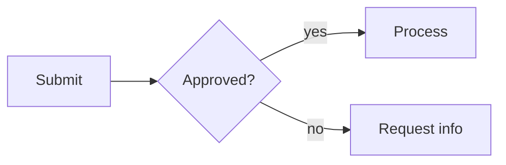

# Markdown reference

What you can write in a document body and how it renders in each format. Variables, merge
fields and includes are covered in the [authoring guide](authoring-guide.md); forms in the
[PDF forms guide](pdf-forms-guide.md); slides in the [slides guide](slides-guide.md).

## Enabled Markdown features

PDF, Word and slide output share the same Markdown engine (Python-Markdown) with these
extensions:

| Feature | Syntax | Notes |
|---------|--------|-------|
| Tables | pipe tables, `:---`, `:---:`, `---:` alignment | See [Tables](#tables). |
| Fenced code | ```` ```lang ```` | Code, inline code and escaped `\$` stay literal; never treated as math. |
| Footnotes | `text[^1]` and `[^1]: note` | Real footnotes in PDF and Word. |
| Definition lists | `Term` then `: definition` | |
| Abbreviations | `*[HTML]: Hypertext Markup Language` | |
| Attribute lists | `{: .class #id }` | Use for CSS hooks in PDF. |
| Markdown inside HTML | `<div markdown="1">…</div>` | Needed inside `<form>` and `<div>` blocks. |
| Table of contents | `[TOC]` | |
| Math | `$x^2$`, `\(x^2\)`, `$$…$$`, `\[…\]` | See the authoring guide, *LaTeX equations*. |

HTML you write is passed through to PDF. Word understands the common inline tags (`strong`,
`em`, `code`, `del`, `sup`, `sub`, `a`, `br`, `img`), lists, tables, `pre`, `blockquote`, `hr`
and `div style="text-align: …"`.

## Tables

```markdown
| Item | Description |
|:-----|:------------|
| Short | A long description that wraps across the available width. |
```

- **Column widths.** Put `<!-- col-widths: 30, 70 -->` on the line before a table, or set
  `table_col_widths: [30, 70]` for every table. The counts must match the column count or the
  widths are ignored. PDF, DOCX and DOTX all honour them; without them columns are sized to
  their content, as in PDF.
- **Headerless tables.** Make every header cell empty and the header row is dropped in every
  format. Useful for signature blocks:

  ```markdown
  | | |
  | --- | --- |
  | Greg Shallard | [[signed_date]] |
  ```
- **Images and equations in cells** work in PDF and Word.
- **Page splitting.** A table is kept on one page when it fits; a header row repeats when a long
  table does split. Adjacent tables stay separate in Word.
- Zebra rows, header colours and padding come from the theme (see the
  [theming guide](theming-guide.md)).

## Images

`` resolves relative to the document's folder and is sized to fit
the text width. Use `<!-- pagebreak -->` to move one to a new page. (Logo and cover images set
in config are resolved through the document, ancestors, repo-root cascade instead.)

## Page breaks and sections

- `<!-- pagebreak -->` on its own line starts a new page in PDF and Word.
- With a theme that sets `h1 { page-break-before: always }` every H1 starts a page (never the
  first one).
- Every `##` subsection inside a `# APPENDIX` section starts a new page.
- Headings are kept with the content that follows; tables, code blocks and quotes avoid
  splitting.

## Alignment and layout

- `body_text_align: justify` (config) justifies Word body text.
- Wrap a section in `<div style="text-align: left">…</div>` to override alignment for it; every
  paragraph and heading inside inherits it. PDF uses the CSS directly.

## Diagrams (Mermaid)

Fenced `mermaid` blocks render to inline SVG in PDF with no external service, coloured from your
theme. In Word and PowerPoint they are embedded as images (this needs the `[mermaid]` extra,
which installs `cairosvg`; without it the code block stays as text).

| Diagram | Keyword |
|---------|---------|
| Flowchart (8 node shapes, 4 edge styles, labels, subgraphs) | `flowchart` / `graph` |
| Pie and donut | `pie`, `donut` |
| Bar chart | `bar` / `xychart-beta` |
| Gauge | `gauge` |
| Sequence | `sequenceDiagram` |
| Timeline | `timeline` |
| Gantt | `gantt` |
| Mind map | `mindmap` |
| Entity-relationship | `erDiagram` |
| State | `stateDiagram`, `stateDiagram-v2` |

````markdown

````

Keep labels short. Examples of every type are in
`examples/feature-showcase/diagram-gallery.md`.

## Values and placeholders

| Syntax | Meaning | Where |
|--------|---------|-------|
| `{{ variable }}` | Filled in at build time from `_meta.yml` or frontmatter | all formats |
| `` | Insert a shared fragment from a `templates/` folder | all formats |
| `[[field]]` | Word merge or form field, declared in `_merge_fields.yml` | `.dotx` |
| `?[type: name]` | Fillable PDF field | `pdf_forms: true` PDF; Word forms in `.dotx` |
| `<!-- notes: … -->`, `<!-- slide … -->` | Speaker notes and slide layouts | `pptx` |

`{{ }}` supports Jinja2 filters (`{{ status | upper }}`, `{{ x | default("n/a") }}`). Fragment
lookup order: the document's folder, a local `templates/`, ancestor `templates/` folders
(deepest first), then the repo-root `templates/`.

## Differences between formats

- Interactive fields exist only in PDF (`pdf_forms`) and `.dotx`; plain `.docx` shows bordered
  boxes for print-and-write.
- Cover pages, headers, footers, header bars and section bars render in PDF and Word;
  `cover_background` is PDF only (Word has no per-page fill).
- Math is native and editable in Word, static SVG in PDF, and not supported in PowerPoint.
- `css_vars` and `@page` margin boxes are PDF CSS; Word mirrors the footer boxes and page
  geometry (see the [theming guide](theming-guide.md)).
