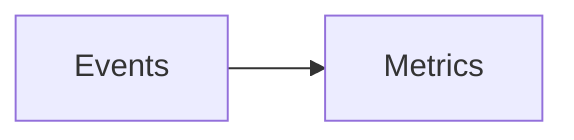

# Slides authoring guide (`pptx` output)

md-doc turns Markdown into PowerPoint decks. You can push any document
through it, but decks read best when they're **written as decks** — short
bullets, one idea per slide, and the layout directives below. A complete
worked example lives at `examples/blueshift/decks/quarterly-review.md`.

## Setup

```yaml
# _meta.yml (or document frontmatter)
outputs: [pptx]
slide_size: "16:9"       # or "4:3" — quote it
slide_split: h2          # h2 (default) | h1 | marker
pptx_template: templates/brand.pptx   # optional brand master
```

```bash
md-doc build decks/ --format pptx
```

## How Markdown becomes slides

| Markdown | Slide |
|----------|-------|
| first `# H1` (or `title`) | title slide (with `product` / `author` / `date`) |
| later `# H1`s | section-divider slides |
| each `## H2` | content slide (H2 → slide title) |
| `<!-- slide -->` | force a new slide anywhere |
| `<!-- notes: … -->` | speaker notes on the current slide |

Bullets (with nesting), tables, images, fenced code, blockquotes, and Mermaid
diagrams all render. Body text is set at slide sizes (18pt body / 14pt code)
using the colours and fonts from your CSS theme cascade — the same
`_pdf-theme.css` / `_theme.css` the other formats use. If a slide holds more
text than fits, it shrinks to fit rather than spilling off the canvas — but
that's a smell: split the slide instead.

## Layout directives

A directive starts a new slide with a specific layout. Put it on its own
line, with blank lines around it. The **next heading names that slide**
instead of starting another one:

```markdown
<!-- slide: stat -->

## Q2 Highlights

- **47%** revenue growth YoY
- **12.4k** active workspaces
```

### `section` — forced divider

```markdown
<!-- slide: section background=#1b4f72 -->

# Part Two
```

You get section slides automatically from later `# H1`s; the directive is for
forcing one from an `## H2` (or adding a `background`).

### `columns` — side-by-side content

`<!-- col -->` divides the columns (2–4). Text, bullets, code, tables, and
images all obey the divider:

```markdown
<!-- slide: columns -->

## Wins vs. Watch-outs

**Shipped**

- Streaming ingestion

<!-- col -->

**Needs attention**

- Support backlog
```

### `stat` — big-number tiles

Each bullet becomes a tile (up to 4): the **bold** text is the big number,
the rest is the caption below it.

```markdown
<!-- slide: stat -->

## The Numbers

- **47%** YoY growth
- **99.98%** uptime
```

### `quote` — centred pull-quote

The blockquote renders large and centred; a paragraph starting with `—`
becomes the attribution:

```markdown
<!-- slide: quote -->

> Nova cut our weekly reporting from two days to twenty minutes.

— VP Data, Stormfront Inc.
```

### `image` — picture showcase

Pictures (including Mermaid diagrams) fill the body area, centred; multiple
pictures sit side by side; any text becomes a small centred caption:

````markdown
<!-- slide: image -->

## Ingestion Pipeline


````

### `center` — centred statement

Content is vertically and horizontally centred — good for closers:

```markdown
<!-- slide: center background=#1b4f72 -->

**Next quarter: self-serve onboarding.**
```

### `background=` — solid fill on any layout

`background=#hex` works on every directive. Dark fills automatically flip
the slide's text to white.

## Tips

- **Write deck-first.** Don't reuse a print document; letterheads and legal
  disclaimers make bad slides. Keep decks in their own folder with
  `outputs: [pptx]` in `_meta.yml`.
- **One idea per slide.** If the autofit shrink kicks in, split the slide.
- **Brand masters**: point `pptx_template` at a `.pptx`/`.potx` whose
  "Title Slide", "Section Header", and "Title Only" layouts carry your brand.
- Unknown layout names degrade to the default content layout with a warning —
  a typo won't break the build.
