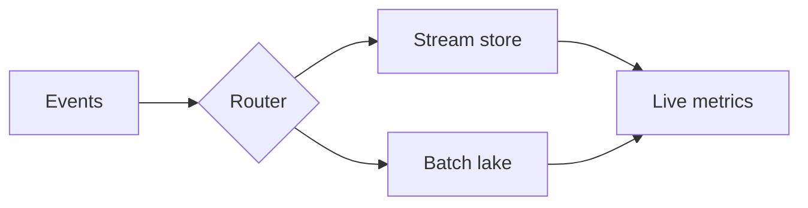

# Nova Analytics — Q2 Review

## Agenda

- Quarter highlights
- Growth numbers
- Platform architecture
- Customer voice
- What's next

<!-- notes: Keep the agenda under 30 seconds — the detail comes later. -->

<!-- slide: section background=#1b4f72 -->

# The Quarter in Numbers

<!-- slide: stat -->

## Q2 Highlights

- **47%** revenue growth YoY
- **12.4k** active workspaces
- **99.98%** API uptime
- **3.1s** median report build

<!-- notes: Uptime excludes the scheduled May maintenance window. -->

<!-- slide: columns -->

## Wins vs. Watch-outs

**Shipped this quarter**

- Streaming event ingestion
- PowerPoint export pipeline
- EU data residency

<!-- col -->

**Needs attention**

- Enterprise onboarding time
- Support backlog in APAC
- Legacy dashboard migration

<!-- slide: section background=#1b4f72 -->

# Platform

<!-- slide: image -->

## Ingestion Pipeline

<!-- notes: The router fan-out is the piece that unblocked streaming. -->

## Usage by Plan

| Plan | Workspaces | Growth |
|:-----|-----------:|-------:|
| Free | 8,100 | +21% |
| Team | 3,400 | +38% |
| Enterprise | 900 | +64% |

<!-- slide: quote -->

> Nova cut our weekly reporting from two days to twenty minutes.

— VP Data, Stormfront Inc.

<!-- slide: center background=#1b4f72 -->

**Next quarter: self-serve enterprise onboarding.**

<!-- notes: Close on the roadmap ask — headcount for the onboarding squad. -->
