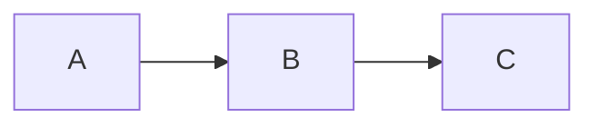
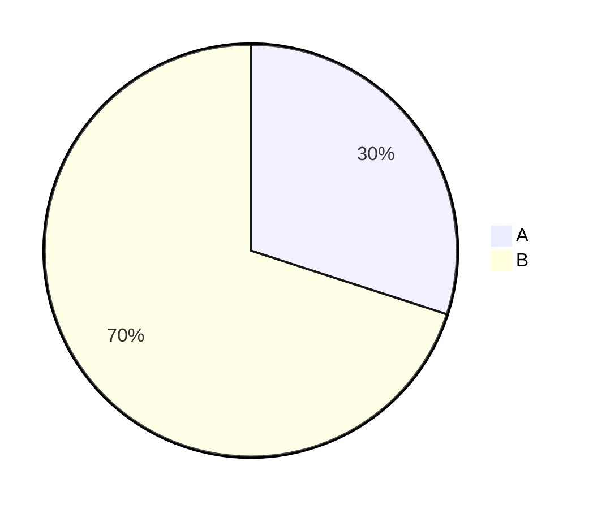
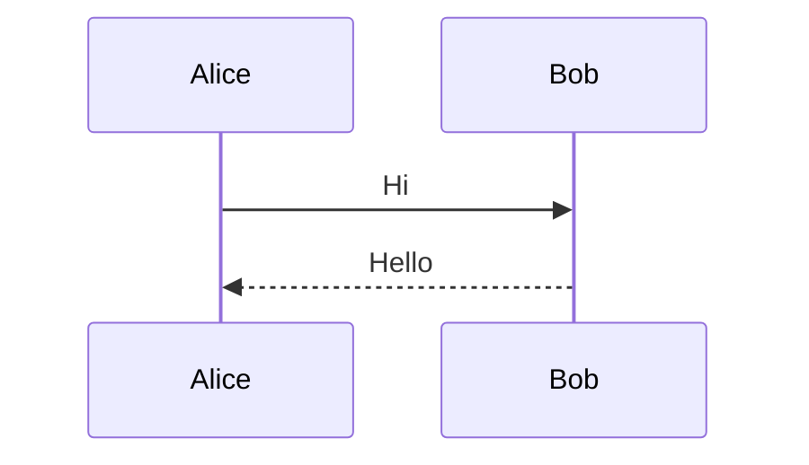
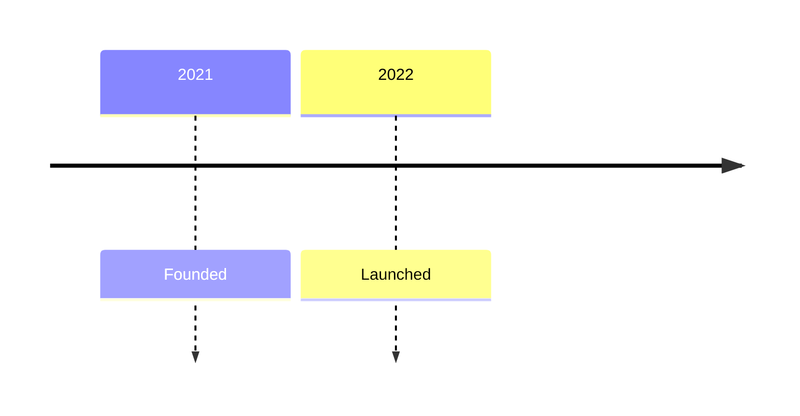
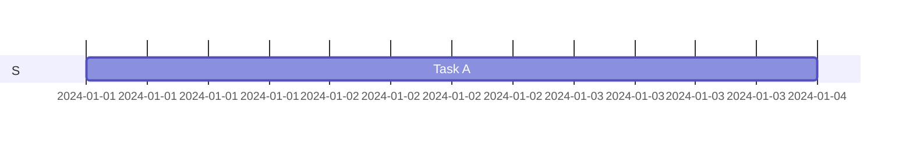
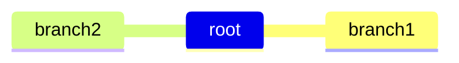
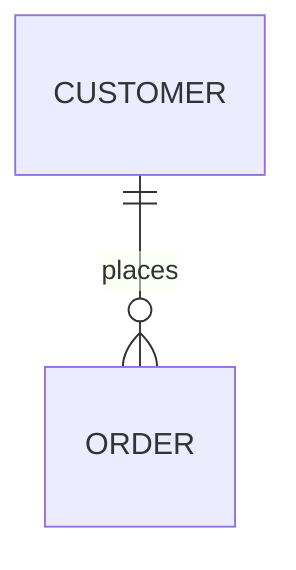
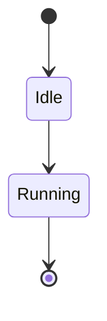

# Flowchart diagram



<!-- pagebreak -->

# Pie diagram



<!-- pagebreak -->

# Donut diagram

```mermaid
donut
"A" : 30
"B" : 70
```

<!-- pagebreak -->

# Bar diagram

```mermaid
bar
"Jan" : 10
"Feb" : 20
```

<!-- pagebreak -->

# Gauge diagram

```mermaid
gauge
  value 42
  min 0
  max 100
```

<!-- pagebreak -->

# Sequence diagram



<!-- pagebreak -->

# Timeline diagram



<!-- pagebreak -->

# Gantt diagram



<!-- pagebreak -->

# Mindmap diagram



<!-- pagebreak -->

# Er diagram



<!-- pagebreak -->

# State diagram


