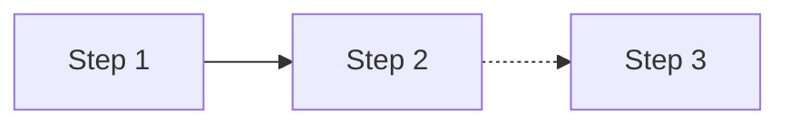
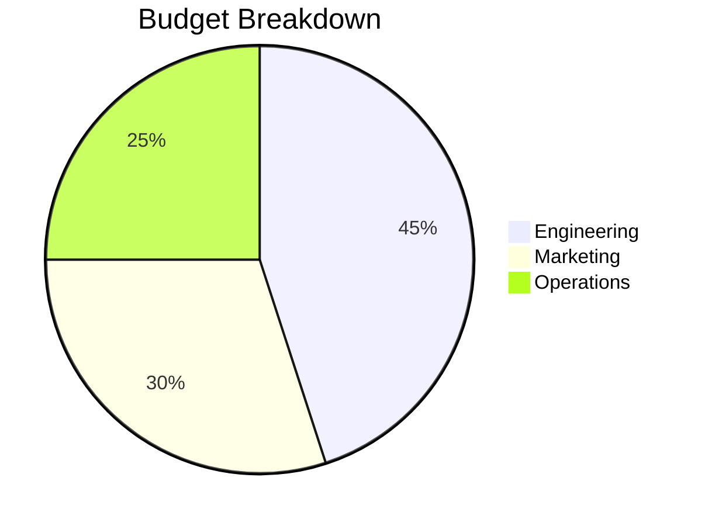
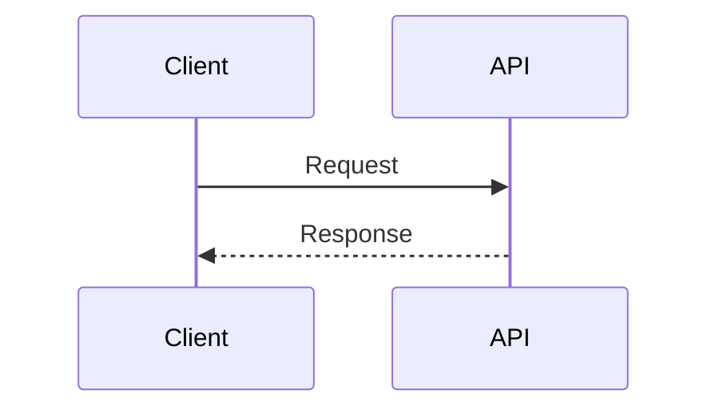
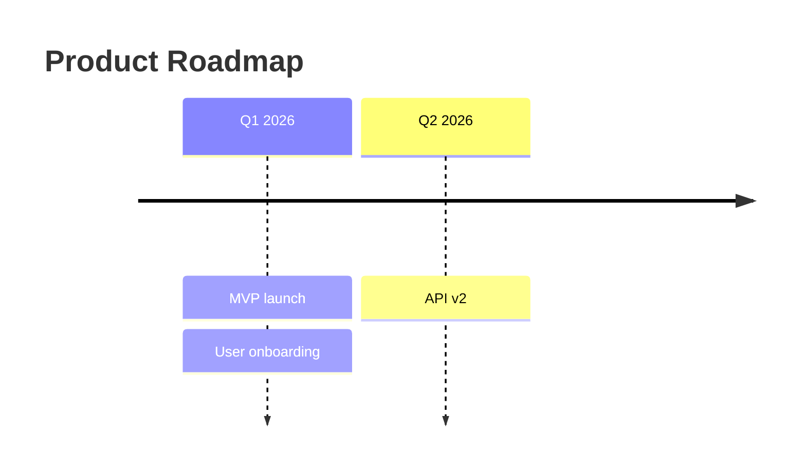
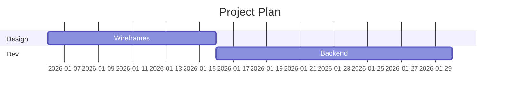
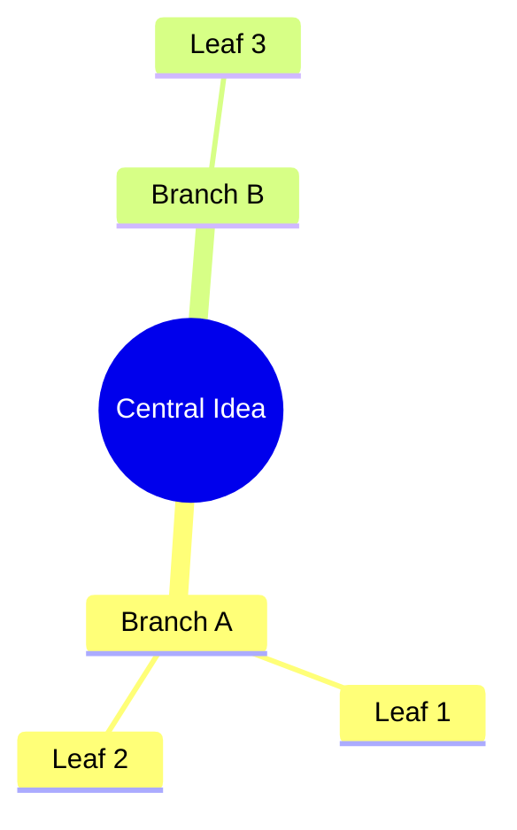
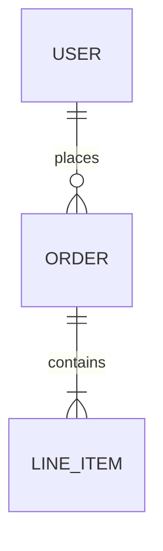
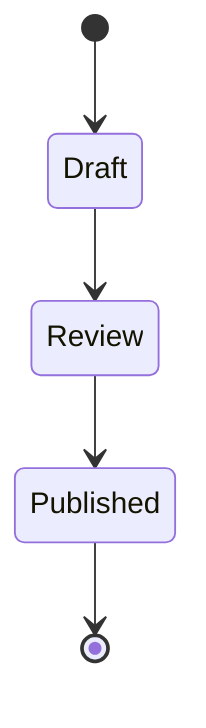

# CLAUDE.md

This file provides guidance to Claude Code (claude.ai/code) when working inside the `workspace/` folder. You are here to **author documents**, not to modify the pipeline itself.

---

## Your job here

Write `.md` files that the pipeline will build into PDF, Word, or mail-merge templates. You are not modifying pipeline source code. If you need to change how the pipeline works, go to the repo root.

---

## Folder structure

Every company lives in its own folder under `workspace/`. The structure inside is yours to define — nest as deeply as makes sense:

```
workspace/
  acme/
    _meta.yml              ← author, default outputs, sync target
    _pdf-theme.css         ← brand colours and fonts (PDF + Word fallback)
    _docx-theme.css        ← Word-specific overrides (optional)
    _merge_fields.yml      ← available [[fields]] for mail merge
    templates/
      company-header.md    ← reusable header fragment
      legal-footer.md      ← reusable footer fragment
    clients/
      stormfront/
        _meta.yml          ← client, account_manager
        _merge_fields.yml  ← client-specific fields
        proposals/
          q1-proposal.md
    products/
      alpha/
        _meta.yml          ← product, version
        reports/
          may-report.md
```

All `_` prefixed files are config — they cascade down automatically. You never need to repeat a value set in a parent folder.

---

## Three variable types — never mix them up

**`{{ variable }}`** — resolved from `_meta.yml` at build time. Use for values already known when the document is built: `{{ author }}`, `{{ version }}`, `{{ product }}`, `{{ client }}`.

**`[[field_name]]`** — becomes a Word merge field in `.dotx` output. Use for values filled in at send time: `[[contact_name]]`, `[[invoice_total]]`. Only use field names defined in `_merge_fields.yml`.

**``** — inserts a shared content block. Only use template names that actually exist in a `templates/` folder at this level or above.

---

## Document frontmatter

Every document starts with a YAML block:

```yaml
---
title: Q1 Project Report
document_type: report
version: "1.0"
status: draft
outputs: [pdf]
cover_page: true
---
```

- **`outputs`** — `pdf`, `docx`, or `dotx`. Multiple: `[pdf, dotx]`
- **`output_dir`** — directory to write built outputs into. Cascades from parent `_meta.yml`; override at any folder or document level. CLI `--output` always wins. Supports `~`. Example: `output_dir: /mnt/NAS/Letters/`
- **`cover_page`** — `true` adds a branded cover; `false` starts with the body. Default is `true`
- **`cover_label`** — text above the title on the cover page. Default: `"Report"`. Set to `"Concept"`, `"Proposal"`, etc.
- **`cover_text_align`** — `left` or `right`. Default: `"left"`
- **`cover_background`** — cover page background colour. Default: `"white"`
- **`cover_divider`** — show horizontal rule under title. Default: `true`
- **`cover_meta_label`** — label before the author name on cover. Default: `"Prepared by"`
- **`cover_meta_author`** — override the author name shown on cover only. Default: inherits `author`
- **`cover_bar`** — show coloured bar(s) on cover. Default: `true`
- **`cover_bar_position`** — `top`, `bottom`, or `both`. Default: `"top"`
- **`cover_bar_height`** — bar height. Default: `"10mm"`
- **`cover_bar_top_height`** — top bar height (overrides `cover_bar_height`). Default: same as `cover_bar_height`
- **`cover_bar_bottom_height`** — bottom bar height (overrides `cover_bar_height`). Default: same as `cover_bar_height`
- **`cover_bar_logo`** — logo image inside the cover bar (resolved like `header_logo`)
- **`cover_text_on_bar`** — `true` to place cover content inside the top bar. Default: `false`
- **`cover_stripe`** — vertical accent stripe on cover. Default: `false`
- **`cover_stripe_height`** — stripe height. Default: `"120mm"`
- **`cover_stripe_width`** — stripe width. Default: `"6mm"`
- **`cover_footer_text`** — footer text on cover. Default: `"{author} · Confidential"`. Supports `\n` for line breaks
- **`cover_footer_line`** — show border-top line on footer. Default: `true`
- **`cover_footer_color`** — footer text colour
- **`document_type`** — informational label used in the document register
- **`status`** — `draft`, `final`, or `superseded`
- **`header_logo`** — path to a logo image for page headers (resolved from doc dir → ancestors → repo root)
- **`header_logo_position`** — `left`, `center`, or `right`. Default: `right`
- **`header_text`** — text shown in page header on every page
- **`header_text_position`** — `left`, `center`, or `right`. Default: `left`
- **`section_bar`** — `true` to add coloured background bars on H1/H2 headings
- **`section_bar_color`** — bar colour. Default: `"#2563eb"`
- **`section_bar_text_on_bar`** — `true` for white text on coloured bar, `false` for border-top line mode. Default: `true`
- **`section_bar_text_color`** — text colour when text_on_bar is true. Default: `"#ffffff"`
- **`section_bar_headings`** — comma-separated heading tags to style. Default: `"h1,h2"`
- **`page_header_bar`** — `true` to add a solid coloured bar on every content page (not cover)
- **`page_header_bar_color`** — bar colour. Default: `"#2563eb"`
- **`page_header_bar_text_color`** — text colour inside the bar. Default: `"#ffffff"`
- **`page_header_bar_height`** — bar height. Default: `"12mm"`
- **`page_header_bar_padding`** — gap between bar and content. Default: `"6mm"`
- **`page_header_bar_logo`** — single logo in the page header bar (falls back to `header_logo`)
- **`page_header_bar_logo_position`** — `left`, `center`, or `right`. Default: `right`
- **`page_header_bar_logos`** — list of `{path, position}` objects for multi-logo support

Values already set in a parent `_meta.yml` don't need to be repeated here. Only set what's different or new for this specific document.

---

## Config files

### `_meta.yml`
Set values that apply to everything at this level and below. Only include keys that are new or different from the parent — don't repeat inherited values.

```yaml
# workspace/acme/_meta.yml
author: Acme Corp
outputs: [pdf]

# workspace/acme/clients/stormfront/_meta.yml — only what's new here
client: Stormfront Inc
account_manager: Jane Smith
```

### `_merge_fields.yml`
Documents the `[[fields]]` available for mail merge at this level. Cascades additively — deeper levels add to parent fields.

```yaml
# workspace/acme/_merge_fields.yml
contact_name: Full name of the primary contact
company: Client company name
sign_off: Closing signatory name

# workspace/acme/clients/stormfront/_merge_fields.yml
client_ref: Client's internal reference number
```

Run `md-doc fields [DIR]` to see all fields available at any folder level.

### `_pdf-theme.css`
Brand colours and fonts for PDF output. Created by `md-doc theme init` (full theme) or `md-doc theme override` (colour-only override that inherits from a parent theme via `@import`). Commit this file — it is config, not a build output.

Also used as the fallback Word theme when `_docx-theme.css` is absent (see below).

### `_docx-theme.css`
Optional Word-specific CSS overrides for `docx` and `dotx` output. Same format as `_pdf-theme.css`, but only the properties meaningful to python-docx need to be included:

- `body { font-family: ...; font-size: ...pt; }` — body font
- `code { font-family: ...; }` — monospace font
- `h1`–`h4 { color: ...; font-size: ...pt; }` — heading colours and sizes
- `th { background: ...; color: ...; }` — table header shading

**Resolution order:** When building Word output, the pipeline walks from the document directory up to the workspace root. At each level it checks for `_docx-theme.css` first, then `_pdf-theme.css`. The first file found wins — same cascading logic as all other config files.

If no theme file exists in the hierarchy, Word output uses python-docx default styles.

Commit this file alongside `_pdf-theme.css` — it is config, not a build output.

---

## Commands to use from the repo root

```bash
# Check documents before building
uv run md-doc lint workspace/acme/

# Build
uv run md-doc build workspace/acme/
uv run md-doc build workspace/acme/ --format dotx
uv run md-doc build my-doc/ --theme path/to/_pdf-theme.css  # one-off theme override

# See available merge fields at a folder level
uv run md-doc fields workspace/acme/clients/stormfront/

# Scaffold a new folder or document
uv run md-doc new folder clients/newcorp --in workspace/acme/
uv run md-doc new doc proposal --in workspace/acme/clients/newcorp/

# Create a brand theme
uv run md-doc theme init workspace/acme/
uv run md-doc theme override workspace/acme/products/pulse/
```

---

## Authoring rules

- Use `#` H1 for the document title — this becomes the cover page heading in PDF
- Use `##` H2 for major sections, `###` H3 for subsections
- Recipient-specific data in `.dotx` documents always uses `[[field]]` syntax
- For `.dotx` files, set `cover_page: false` unless the template genuinely needs one
- Run `md-doc lint` before `md-doc build` — it catches broken variables, missing includes, and undefined fields without invoking WeasyPrint

---

## Mermaid Diagrams

Fenced `mermaid` code blocks are automatically rendered to inline SVGs in PDF output. No external tools needed. Diagram colours are auto-themed from the document's `_pdf-theme.css`.

### Flowchart

````markdown

````

**Node shapes:** `["rect"]`, `{"diamond"}`, `(["stadium"])`, `("rounded")`, `(("circle"))`, `[("cylinder")]`, `{{"hexagon"}}`, `[["subroutine"]]`

**Edge styles:** `-->` solid, `-.->` dotted, `==>` thick, `---` no arrow

**Labels:** `-- "label" -->` or `-->|"label"|` (pipe syntax)

**Subgraphs:** `subgraph id["Label"]` ... `end`

### Pie Chart

````markdown

````

### Donut Chart

````markdown
```mermaid
donut
    title Time Allocation
    "Coding": 40
    "Meetings": 20
    "Admin": 10
```
````

### Bar Chart

````markdown
```mermaid
bar
    title Monthly Revenue
    x-axis ["Jan", "Feb", "Mar", "Apr"]
    bar [35, 48, 52, 61]
```
````

### Gauge

````markdown
```mermaid
gauge
    title System Health
    value 78
    min 0
    max 100
```
````

### Sequence Diagram

````markdown

````

### Timeline

````markdown

````

### Gantt Chart

````markdown

````

### Mind Map

````markdown

````

### ER Diagram

````markdown

````

### State Diagram

````markdown

````

---

## PDF Forms

Add `pdf_forms: true` to frontmatter to produce an interactive fillable PDF. The output file gets a `-form` suffix automatically: `onboarding.md` → `onboarding-form.pdf`.

```yaml
---
title: Staff Onboarding Form
pdf_forms: true
cover_page: false
---
```

### Rules

- **Wrap all fields in explicit `<form>` tags.** WeasyPrint does not auto-wrap — fields outside a `<form>` element will not become interactive.
- **Every field needs a `name` attribute** — it becomes the AcroForm field name in the PDF. Use `snake_case`.
- Set `cover_page: false` for forms — the cover page is rarely useful on a form document.

### Example

```markdown
<form>

**Full name** <input type="text" name="full_name" required>

**Department**
<select name="department">
  <option value="">— Select —</option>
  <option value="engineering">Engineering</option>
  <option value="sales">Sales</option>
</select>

**Notes**
<textarea name="notes" rows="4"></textarea>

**I confirm the above is correct**
<input type="checkbox" name="confirmed"> Yes

</form>
```

### Supported field types

| HTML element | PDF field type |
|---|---|
| `<input type="text">` | Text field (`maxlength`, `required` honoured) |
| `<input type="date">` | Text field with date hint |
| `<input type="number">` | Text field with numeric hint |
| `<input type="checkbox">` | Checkbox |
| `<input type="radio" name="x" value="y">` | Radio group (all same `name` = one group) |
| `<select>` | Dropdown |
| `<textarea>` | Multiline text (`rows` controls height) |
| `<input type="submit">` | Submit button |

### What NOT to do with forms

- Do not use `outputs: [formpdf]` — the output type is still `pdf`. The `pdf_forms: true` flag is what activates interactive fields.
- Do not omit `<form>` tags — fields outside a `<form>` render as static content with no interactivity.
- Do not omit the `name` attribute — WeasyPrint silently ignores nameless fields.

---

## What NOT to do

- Do not modify anything in `md_doc/`, `tests/`, or the root `pyproject.toml` — that is pipeline code
- Do not create files named `CLAUDE.md`, `README.md`, or `CHANGELOG.md` inside workspace projects — the build system skips them and they will confuse future authors
- Do not invent `{{ variable }}` names — only use names confirmed to exist in the `_meta.yml` cascade
- Do not invent `[[field]]` names — only use names defined in a `_merge_fields.yml` file
- Do not invent `` paths — only use templates that actually exist
